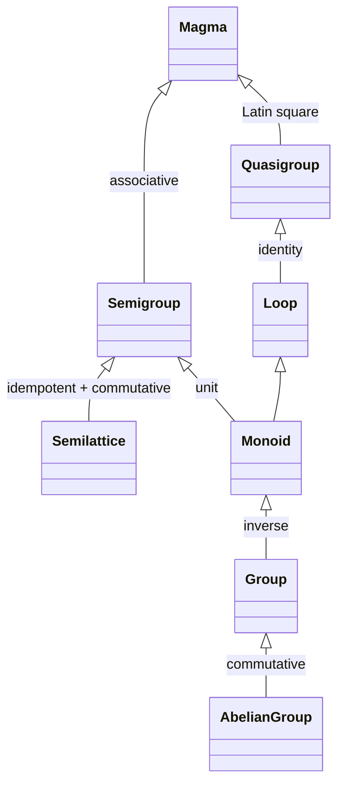

# Algebras

This part introduces the algebraic structures built on `Azon` — sets equipped with closed operations and constrained by laws.

---

**`Structure`** := a connected `Graph` — for every subset of `Vertex` there exists an `Arrow` entering or exiting

> `∀V' ⊊ V: ∃r ∈ L: (DOM(r) ∩ V' ≠ 0 ∧ COD(r) ⊄ V') ∨ (COD(r) ∩ V' ≠ 0 ∧ DOM(r) ⊄ V')`

Ensures structural coherence — no subset of `Vertex` is completely isolated. |

Every structure here is a `Set` of `Azon` with one or more operations, and every law is a `Path`-preservation condition on those operations (see [02-graph](03-graph.md)).

## Operations

An `operation` on a set `S` is an `Azon` of arity `n` whose `Domain` is `Sⁿ` and `Codomain` is `S` — i.e. it is *closed* on `S`. Arity classifies operations; laws (below) constrain them.

| Arity | Term | Signature | Examples |
| ----------- | ------------ | ------------ | ---------- |
| `0-ary` | Constant / Nullary | `() → S` | `unit: () => 1`, `zero: () => 0` |
| `1-ary` | Unary | `S → S` | `inc: a => a+1`, `neg: a => -a`, `inv: a => a⁻¹`, `⊥: a => ¬a` |
| `2-ary` | Binary | `S × S → S` | `add: (a,b) => a+b`, `mul: (a,b) => a·b`, `∧, ∨` |
| `2-ary (predicate)` | Relation | `S × S → {T, F, U}` | `eq: (a,b) => a==b`, `≤: (a,b) => a≤b` |
| `n-ary` | n-ary | `Sⁿ → S` | `combine: (a₁, …, aₙ) => …` |
| `External` | Action | `Ω × S → S` | scalar multiplication `(λ, v) => λ·v` in a vector space |

`Notes.`

- A `Pointed Set` is a set equipped with one or more `constants` (0-ary operations).
- A `Unary System` carries one `unary` operation; a `Magma` carries one `binary` operation; a `Ringoid` carries two binary operations linked by distributivity.
- A `relation` is a predicate-valued operation — not closed on `S` but on `{T, F, U}`. `Setoid` and `Poset` are built on relations, not operations proper.
- An `external` operation acts *from* a second set `Ω` — this is how `Module`, `Vector Space`, and `Group with Operators` extend a single-set algebra into a two-set structure (see [Two Sets with Operations](#two-sets-with-operations)).
- An n-ary operation of arity ≥ 3 can always be `curried` into a chain of unary operations via `Composition` (see [02-graph](03-graph.md)) — operations and `Azon` are the same kind of thing.

## Laws

The laws referenced by the structures below. Each is a constraint on a unary, binary, or n-ary operation `*` over a set `S`.

| Law | Formula | Notes |
| ----------- | ------------ | ------ |
| `Reflexive` | `∀a ∈ S: a * a` holds | For relations: every element relates to itself. |
| `Symmetric` | `∀a, b ∈ S: a * b ⟹ b * a` | For relations; together with reflexivity and transitivity defines an equivalence. |
| `Antisymmetric` | `∀a, b ∈ S: (a * b ∧ b * a) ⟹ a = b` | Distinguishes orders from equivalences. |
| `Transitive` | `∀a, b, c ∈ S: (a * b ∧ b * c) ⟹ a * c` | Chains relate. |
| `Associative` | `(a * b) * c = a * (b * c)` | Order of grouping is irrelevant. |
| `Commutative` | `a * b = b * a` | Order of operands is irrelevant. |
| `Idempotent` | `a * a = a` | Repeating an operand has no effect. |
| `Identity (Unit)` | `∃e ∈ S: ∀a ∈ S: e * a = a * e = a` | A neutral element. |
| `Inverse` | `∀a ∈ S: ∃a⁻¹ ∈ S: a * a⁻¹ = a⁻¹ * a = e` | Every element is undoable (requires identity). |
| `Zero` | `∃0 ∈ S: ∀a ∈ S: 0 * a = a * 0 = 0` | An annihilating element. |
| `Distributive` | `a * (b ⊕ c) = (a * b) ⊕ (a * c)` | One operation distributes over another. |
| `Absorption` | `a ∨ (a ∧ b) = a` and `a ∧ (a ∨ b) = a` | Couples two operations in a lattice. |
| `Latin square` | `∀a, b ∈ S: ∃! x, y ∈ S: a * x = b ∧ y * a = b` | Unique left- and right-solutions — defines a quasigroup. |
| `Jacobi` | `a * (b * c) + b * (c * a) + c * (a * b) = 0` | A weakened associativity used in Lie algebras. |

`Equivalence vs. order.` A `Setoid` requires Reflexive + Symmetric + Transitive (equivalence). A `Poset` requires Reflexive + Antisymmetric + Transitive (partial order). Replacing symmetry with antisymmetry is what turns *sameness* into *direction*.

## Basic Structures

| Structure | Definition | Example |
| ----------- | ------------ | --------- |
| `Pointed Set` | Set with defined units (0-ary operations) | `unit: () => 1` |
| `Unary System` | Set with a single unary operation | `inc: (x) => x+1` |
| `Pointed Unary System` | Unary system with a pointed set | `zero: ()=>0, unit: ()=>1, inv: (x)=> x==1 ? 0 : 1` |
| `Poset` | Partially ordered set with `compare` defined partially | `≤: a,b => a,b in P ? (a < b ? T : F) : U` |
| `Setoid` | Set with `eq` equivalence | `eq: (a, b) => a == b ? T : F` (Reflexive+Associative+Transitive) |

## Magma and Descendants

| Structure | Definition | Properties |
| ----------- | ------------ | ------------ |
| `Magma (Groupoid)` | Having a single binary operation | `op: (a,b) => c` |
| `Quasi-group` | A magma obeying Latin square property | Any a,b Exists x,y : ax = b; ya = b |
| `Loop` | A quasi-group with identity | - |
| `Semi-group` | An associative magma | `combine: a,b => (...) => a(b(...))` |
| `Semi-lattice` | An idempotent and commutative semigroup | Idempotent and commutative |
| `Monoid` | A semigroup with 'unit' | `unit: () => 1` (LR-identity) |
| `Group` | A monoid with 'inverse' | `inverse: a => -a` (LR-inverse) |
| `Abelian Group` | A group with commutative 'sum' | `sum: (a,b) => c` (associative+commutative) |

## Ringoid Structures

| Structure | Definition |
| ----------- | ------------ |
| `Ringoid` | Set with 'add' and 'multiply', multiplication distributing over addition |
| `Semiring` | A ringoid that is also a monoid under each operation |
| `Near-ring` | A semiring whose 'add' is a group |
| `Ring` | A semiring whose 'add' is an abelian group |
| `Boolean Ring` | A commutative ring with idempotent multiplication |
| `Field` | A commutative ring containing multiplicative inverse for every nonzero element |

## Lattice Structures

| Structure | Definition | Laws |
| ----------- | ------------ | ------ |
| `Lattice` | A poset with '∨ - meet (infimum)' and '∧ - join (supremum)' | Commutative, Associative, Absorption |
| `Complete Lattice` | A lattice with arbitrary 'meet' and 'joins' | - |
| `Bounded Lattice` | A lattice with '1-greatest (top)' and '0-least (bottom)' | 0 ≤ x ≤ 1 for every x in L |
| `Complemented Lattice` | A bounded lattice with unary '⊥ - complementation' | a ∨ a⊥ = 1 and a ∧ a⊥ = 0 |
| `Distributive Lattice` | A lattice where meet and join distribute over each other | - |
| `Boolean Algebra` | A complemented distributive lattice | - |

## Two Sets with Operations

| Structure | Definition |
| ----------- | ------------ |
| `Group with Operators` | A group G with a set Ω and binary operation Ω × G → G |
| `Module` | An abelian group M and a ring R acting as operators on M |
| `Vector Space` | A module where the ring R is a division ring or field |
| `Graded Vector Space` | A vector space with direct sum decomposition |
| `Algebra over a Ring` | A module over a commutative ring with compatible multiplication |
| `Associative Algebra` | An algebra with associative multiplication |
| `Lie Algebra` | A nonassociative algebra satisfying the Jacobi identity |
