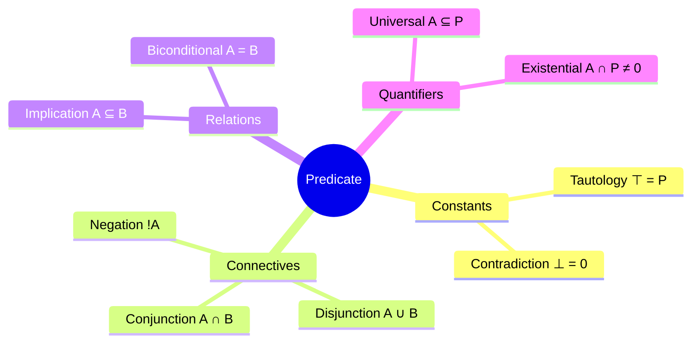

# Correspondence from Sets to Logic of Predicates

A `Predicate` is a `Set` viewed as a truth-test: `P(x) = x` reads *"x satisfies P"*, `P(x) = 0` reads *"x does not satisfy P"*.

Truth and falsity are not a separate Boolean type — they are the *survival* or *erasure* of the input by the filter.

---

**`Predicate`** := A `Set` regarded as a truth-test over the `World`.

> `P(x) ∈ {x, 0}`

*NOTE*: Every `Predicate` *is* a `Set`; every `Set` *is* a `Predicate`.

---

**`Tautology`** := Predicate satisfied by every `Element` of the `World`.

> `⊤ := P`

*NOTE*: The `World` itself, as a `Set`.

---

**`Contradiction`** := Predicate satisfied by no `Azon`.

> `⊥ := 0`

*NOTE*: Coincides with `Zero`.

---

**`Conjunction`** := Both predicates hold.

> `A ∧ B := A ∩ B`

*NOTE*: Set `Intersection`.

---

**`Disjunction`** := At least one predicate holds.

> `A ∨ B := A ∪ B`

*NOTE*: Set `Union`.

---

**`Negation`** := Predicate fails.

> `¬A := !A`

*NOTE*: `Complement` in the `World` `P`.

---

**`Implication`** := A entails B.

> `A → B :: A ⊆ B`

*NOTE*: Equivalent to `∀x: A(x) = x ⟹ B(x) = x`.

---

**`Biconditional`** := A and B have the same extension.

> `A ↔ B :: A = B`

*NOTE*: Set equality.

---

**`Universal`** := Predicate holds throughout a `Set`.

> `∀x ∈ A: P(x) :: A ⊆ P`

*NOTE*: Reduces to `Subset`.

---

**`Existential`** := Predicate holds somewhere in a `Set`.

> `∃x ∈ A: P(x) :: A ∩ P ≠ 0`

*NOTE*: Non-empty `Intersection`.

*NOTES*:

- Predicates on `P` form a **Boolean algebra** under `∧`, `∨`, `¬`, with `⊤ = P` and `⊥ = 0`.
- **De Morgan:** `!(A ∧ B) = !A ∨ !B`, `!(A ∨ B) = !A ∧ !B`.
- **Excluded middle (within `P`):** `A ∨ !A = P`, `A ∧ !A = 0`.
- **Double negation:** `!!A = A`.
- **Quantifier duality:** `∀x ∈ A: P(x) ⟺ ¬∃x ∈ A: ¬P(x)`.
- **Filter composition equals conjunction:** for any `Set` `A`, `B`: `(A ∘ B)(x) = A(B(x)) = x` iff `x ∈ A ∩ B`. Equivalent to `A ∘ B = A ∩ B`. *This is unique to the filter semantics — it does not hold for the standard 0/1-indicator function.*
- **Commutativity from intersection:** since `∩` is commutative, so is filter composition: `A ∘ B = B ∘ A`.

*SEE ALSO*:

- [First-order logic (Wikipedia)](https://en.wikipedia.org/wiki/First-order_logic) — predicate logic in the classical sense.
- [Algebra of sets (Wikipedia)](https://en.wikipedia.org/wiki/Algebra_of_sets) — operations mirrored above.
- [Boolean algebra (Wikipedia)](https://en.wikipedia.org/wiki/Boolean_algebra) — structure formed by predicates on a fixed `World`.
- [De Morgan's laws (Wikipedia)](https://en.wikipedia.org/wiki/De_Morgan%27s_laws) — duality of `∧`/`∨` under negation.
- [Universal quantification (Wikipedia)](https://en.wikipedia.org/wiki/Universal_quantification) and [Existential quantification (Wikipedia)](https://en.wikipedia.org/wiki/Existential_quantification) — quantifier semantics.
