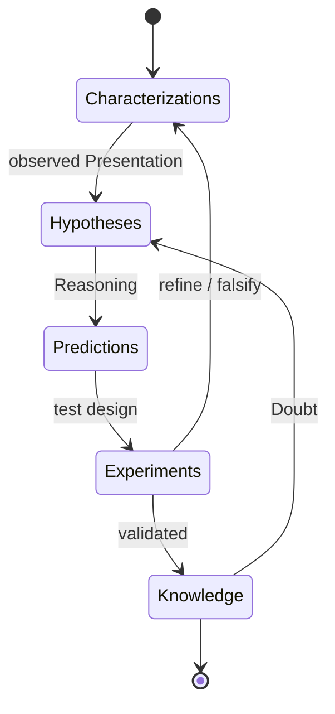

# The Scientific Method

`ScientificMethod` IS a generalized empirical ***a posteriori*** approach to earning `ScientificKnowledge` from experimental data, with awareness of cognitive abilities and `Bias`.

## Scientific Criteria

`Scientific Criteria` IS set of principles over `Knowledge`, to accept it in terms of consistency, adequacy, reliability, predictability, completeness, and non-redundancy.

`Scientific Knowledge` IS a `Knowledge` that definitely meets `Scientific Criteria`.

---

**`Inner Correctness`** := Should not break the axioms of logic.

---

**`Occam's Razor`** := Be minimalistic in concepts used.

---

**`Critical Resistance`** := Withstand comprehensive questioning from other points of view: be able to answer *why*, *what if not*, *what is the alternative*, *what about edge cases*.

---

**`Fair Principle`** := Highlight weaknesses of theory; look for incorrectness.

---

**`Popper Principle`** := Find ways to dismiss theory (falsifiability); keep the door open for future development, rejection, or mind-changing.

---

**`Objectiveness`** := Stand apart from subjective prejudice and preferences. Subjective claims cannot be proved true or false by any generally accepted criteria.

---

**`External Consistency`** := Be correlated with (not contradict) all existing `Knowledge` in the context.

---

**`Predictability`** := Be able to predict the behavior of the object in question.

---

**`Reproducibility`** := Should be stable when reproduced under described conditions and steps.

## Scientific process

`Scientific process` IS an iterative process to acquire NEW *a posteriori* `Knowledge` in four phases:

1. **Characterizations** — observations, definitions, and measurements of the subject of inquiry.
2. **Hypotheses** — theoretical, hypothetical explanations of observations and measurements.
3. **Predictions** — inductive and deductive `Reasoning` from the hypothesis or theory.
4. **Experiments** — peer review and tests of all of the above.

