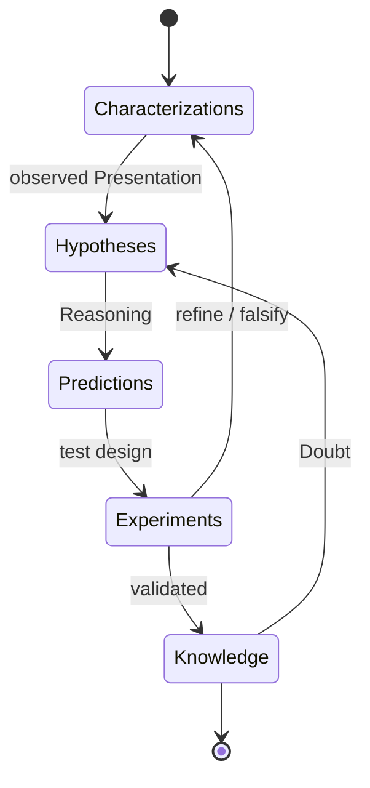

# The Scientific Method

The empirical route to `Scientific Knowledge`: the nine criteria a claim must meet, and the five phases that produce it.

## Method

**`Scientific Method`** := A generalized empirical *a posteriori* approach to earning `Scientific Knowledge` from experimental data, with awareness of cognitive abilities and `Bias`.

## Scientific Criteria

**`Scientific Criteria`** := The nine requirements a `Knowledge` claim must satisfy, from `Inner Correctness` to `Reproducibility`.

**`Scientific Knowledge`** := `Knowledge` that definitely meets `Scientific Criteria`.

---

| Criterion | Requirement |
| --- | --- |
| **`Inner Correctness`** | Does not break the axioms of logic |
| **`Occam's Razor`** | Is minimal in the concepts it uses |
| **`Critical Resistance`** | Withstands questioning from other points of view: *why*, *what if not*, *what is the alternative*, *what about edge cases* |
| **`Fair Principle`** | Highlights its own weaknesses and looks for its own incorrectness |
| **`Popper Principle`** | Offers ways to be dismissed (falsifiability), keeping the door open to revision |
| **`Objectiveness`** | Stands apart from subjective prejudice and preference |
| **`External Consistency`** | Does not contradict existing `Knowledge` in the context |
| **`Predictability`** | Predicts the behavior of the object in question |
| **`Reproducibility`** | Stays stable when reproduced under the described conditions and steps |

## The Scientific Process

**`Scientific Process`** := An iterative process to acquire new *a posteriori* `Knowledge`:

1. **Characterizations** — observations, definitions, and measurements of the subject of inquiry.
2. **Hypotheses** — theoretical, hypothetical explanations of observations and measurements.
3. **Predictions** — inductive and deductive [`Reasoning`](08-reasoning.md) from the hypothesis or theory.
4. **Experiments** — tests of the predictions under described conditions.
5. **Review** — independent scrutiny of all of the above.

