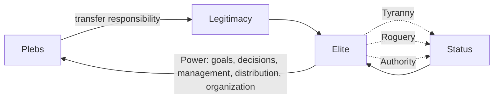
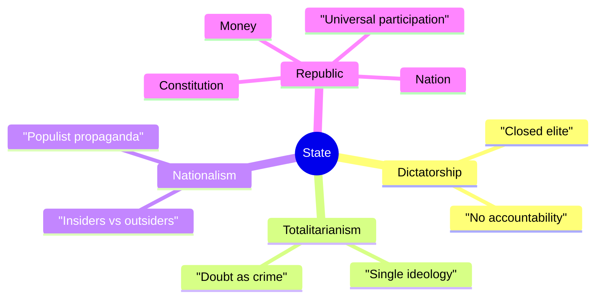

# Power Architecture

## Politics

Distribution of power through non-violent means via social institutions.

### Status

Capacity to impose your will on the environment versus readiness to submit to others'. The hidden currency of all social interaction.

### Elite

The segment of society with the highest status — those with direct access to power.

### Power

Elite status expressed through five functions: setting goals, making decisions, managing, distributing, organizing.

### Plebs

The subordinate majority who trade portions of their rights and freedoms for security and stability.

### Legitimacy

The masses' recognition of the elite's right to rule — granted by voluntary transfer of responsibility for one's fate.

### Three Paths to Status

---

**`Tyranny`** := Direct violence or its threat.

---

**`Roguery`** := Deception, manipulation, information advantage.

---

**`Authority`** := Recognition earned through superior knowledge, skill, will, or character.

> "If you ain't a threat, you're a tool."

## The State

Centralized, sovereign power over a defined territory. Provides:

- Predictable rules of engagement
- Security enabling long-term cooperation
- Mechanisms for collective action
- Formal bureaucratic procedure

### Dictatorship

Power held by one closed elite — usually under a single boss. Defined by suppression of personal rights in favor of state or elite objectives, with no accountability mechanisms.

### Totalitarianism

Rule through a single enforced ideology. All members declare identical values. Doubt is treated as crime. Dissenters are corrected, isolated, or destroyed.

> "The triumph of despotism lies in forcing the slaves to declare themselves free."

> "In any totalitarian idea there is much that is attractive. People fear the diversity and complexity of life. But univocality attracts, madness captivates, it is contagious." — Martin Bormann

### Nationalism

Ideology placing "our people's" supremacy above all other values. Divides humanity into superior insiders and inferior outsiders. Spreads through populist propaganda and simple black-and-white narratives.

### Republic

A state built on principles rather than expedience. Citizens grant the elite legitimacy in exchange for guaranteed rights, balance of interests, and stable development. Elite power is bounded by citizens' capacity to resist — up to removal of criminal power. Political participation is universal and equal.

### Constitution

The formal agreement between elite and society — the supreme law. Defines shared values, goals, mutual rights and obligations, and commitment to human rights.

### Nation

A unity based on shared mentality, heritage, and culture — a cultural-psychological phenomenon, not a biological one.

> "The cheapest form of pride is national pride. It reveals a lack of individual qualities of which he could be proud; for otherwise he would not resort to that which he shares with millions." — Schopenhauer

## Instruments of Control

Power is held not only by force but by shaping the conditions under which the [Plebs](#plebs) choose. Four levers recur:

---

**`Narrative`** := A unifying story — nation, enemy, emergency — that converts private lives into mobilized effort. Patriotism is the cheapest mobilization: it asks the many to bear costs the few do not. See [Nation](#nation), [Enemy Image](30-socium.md#enemy-image).

---

**`Money`** := Whoever defines the medium of exchange defines the limits of action. The more traceable and programmable the money, the finer the control over what may be bought, saved, or refused.

---

**`Property`** := Ownership confers independence; access — rent, lease, subscription — confers leverage to the owner. A population that owns nothing is easier to direct than one that owns its ground.

---

**`Risk`** := Elites tend to externalize danger downward and reserve safety for themselves — the trench for the many, the bunker for the few. Watch where the powerful place their own bodies and savings.

**Read the asymmetry, not the slogan.** In any crisis the question is *who bears the cost and who is insulated from it.* The slogan ("for the nation", "for your security") is the narrative lever; the asymmetry beneath it is the fact. This is not a claim that every such move is a plot — most are ordinary incentives — but power flows to whoever sets these terms, so a free person reads the terms before accepting them.
