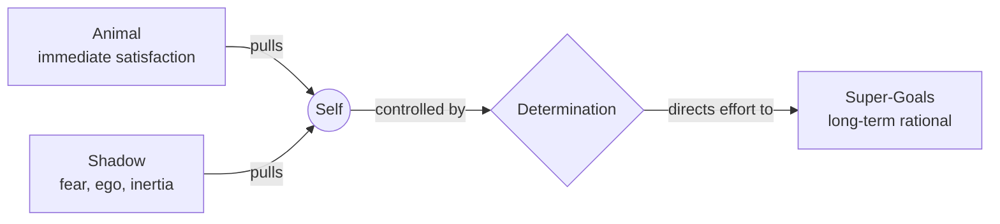

# Mastery

**Definition**: The capacity for abundant, effective activity toward constant improvement in one's chosen Work.

Mastery is measured by:

- **Surplus** — taking only what is needed, giving more than was taken.
- **Body of Work** — a collection of meaningful creations that reflect your unique perspective and skills.
- **Super-Goals** — progressing toward the highest-level ambitions that guide your life and work.

**The Mastery Framework**:
Mindset → Vision → Discipline → Productivity → Growth.

Mindset is the foundation. Vision gives direction. Discipline sustains effort. Productivity multiplies output. Growth compounds everything.

---

## I. Mature Mindset

The inner foundation. Without it, all technique is noise.

**Maturity**: Understanding and accepting one's emotions; expressing, using, and consciously influencing them.

- Emotions connect to action — acting as someone leads to becoming them
- We choose how we react
- Opposite emotions often manifest similarly — we can name them as we choose
- Congruence is the simplest path to social presence

**Openness**: The position of the eternal student — an unfrozen view of the world, with room for error and growth.[[28,29]]

- Explore with curiosity
- Seek feedback; challenge existing knowledge
- Clear preconceptions and biases

### Authenticity

Realize and respect your intrinsic [Human Dignity](../2-human/21-human.md#human-dignity) — your inherent worth rooted in your transcending nature.

Be true to yourself, your values, and your unique path — regardless of external pressure. Your authenticity attracts the right people and opportunities.

[[32,33]]

### Self-Trust

Establish trust and friendship with yourself.

- Consider yourself your best friend — the only one you truly need throughout life.
- Don't lie to yourself. Keep promises to yourself. Repeatedly.

### Accountability

Take full ownership of your personal life. Accept all consequences. Make your own choices, walk your own path. Be independent in reasoning and decisions.

- Don't blame others or circumstances for your failures.
- Don't make excuses, wait for permission, or rely on luck.
- Don't let fear, doubt, ego, or comfort zone trap you in mediocrity.
- Don't let others control your emotions, define your identity, or prevent your growth.

### Acceptance of Imperfection

Accept the chaos and imperfections of Existence — most of which you cannot control or fully understand. Accept yourself as a whole, including bright and shadow sides.

Start with humble, honest acknowledgment of your own weaknesses, biases, and blunders. Don't let the fear of failure stop you from trying. Don't let the pursuit of perfection prevent you from enjoying the process.

[[34]]

### Curiosity and Continuous Learning

Be less certain. Stay open and receptive to ever-changing contexts.

Show deep interest in whatever you do by asking questions from diverse perspectives. Never stop learning — always have room to grow. Expand across culture, science, philosophy, and art.

[[35]]

### Courage

Be hungry, zealous, enthusiastic, keen. Be unafraid of inner inertia or external pressures.

You will regret what you didn't do more than what you did.

[[36]]

### Confidence

Confidence is a skill, not a trait. It can be built, and it transfers across every area of life.

Define it as a generalized expectation of positive or manageable outcomes — not certainty of perfect results, but the steady belief that whatever happens, you can handle it. Confidence is decided first, then practiced, then it becomes a habit, then identity.

- **Self-forgiveness first.** No one performs while secretly punishing themselves. Forgive your past fully and fast, without exception. This is access, not weakness — see [Acceptance of Imperfection](#acceptance-of-imperfection) and [Self-Trust](#self-trust).
- **Step into a role.** You do not need to feel confident; you need to occupy the right role. The role grants permission, permission gives composure, composure gives authority. A firefighter enters the fire as *a firefighter*, not as themselves.
- **Don't outsource self-belief.** Validation and consensus are emotional subcontracting. The same door that lets praise lift you lets criticism lower you. Keep the source internal — see [Accountability](#accountability) and [Authenticity](#authenticity).
- **Move before you feel ready.** Confidence follows action; it does not precede it. You do not need permission to act as if you belong.
- **Regulate before you perform.** Confidence is not volume, charisma, or dominance. It is safety and composure, which give rise to authority.

### Enjoyment

Approach life with humor and optimism despite uncontrollable circumstances.

Do less, but with attitude. Don't take yourself too seriously. Don't let stress consume you or setbacks discourage you. Don't let others' judgments affect your self-worth.

[[37,38]]

### Determination

Define your authentic Way — life's mission, ambitions, high-level goals. Devote yourself with unwavering dedication.

[[39]]

An emotional structure strong enough to sustain:

- Persistent pursuit of Super-Goals to the limit
- Complete focus across all moments and scales of Life
- Control over the Animal and the Shadow

*Foundation*: Attitude toward the process regardless of outcome — Fun, Focus, Courage.

*Powers*: Overcomes obstacles; uses fear as fuel; enables decision-making without waiting for perfect conditions.

*The Conflict*: Determination creates an existential tension between immediate animal satisfaction and long-term rational goals. This confrontation defines the human being's tragedy and greatness.

### Economic Wisdom

- **Save Early**: Automate savings. Compound interest is magic.
- **Live Below Means**: Spend less than you can. Never spend to impress.
- **Invest Wisely**: Put money to work in assets that grow over time. Avoid debt and speculation.

[[30,31]]

---

## II. Clear Vision

Know where you are, where you're going, what to do next.

### Build Mental Models

Delve into context. Create mental models of your circumstances, processes, goals, and obstacles. Refine them through experience until they become simple and useful.

- Understand the system you're operating in — its rules, dynamics, and leverage points.
- Identify the critical path — the few key actions that create the most impact.
- Anticipate obstacles and plan how to overcome them.
- Visualize the process and results as if already achieved — first-person view.

This creates a powerful sense of clarity and motivation.

### Interrogative Self-Talk

Don't say "I can do it" — ask "Can I do it?"

Your brain resists commands (even from you) but can't ignore unanswered questions. Questions activate problem-solving; statements trigger self-evaluation.

**Five Power Questions:**

1. *Initiation*: "What's the smallest step I could take in 5 minutes?"
2. *Friction*: "What's making this harder than it needs to be?"
3. *Agency*: "What part of this is within my control?"
4. *Identity*: "What would a more confident version of me try here?"
5. *Reflection*: "What did this teach me for next time?"

### Strategic Reviews

**Regret Review**: Identify last year's biggest regret. Extract the lesson. Create a plan to prevent repetition.

**Pre-mortem**: Imagine December 31st — your goal failed. Why? Design the year to block those failure modes.

[[40,41]]
