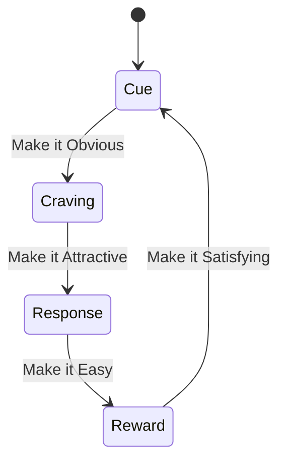
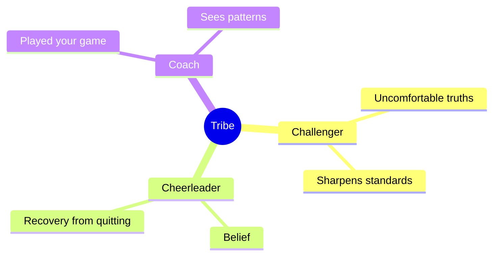
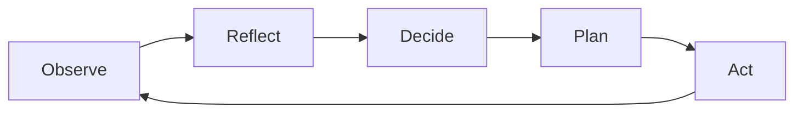

# Self-Discipline

`Productivity` is about creating systems and environments that enable consistent meaningful and effective progress toward your Goals.

`Productivity` is the engine of mastery — without it, even the best mindset and vitality won't lead to progress.

Conquer yourself — your laziness, distractions, and doubts. Then you can conquer anything.

> Small wins → momentum → consistency → confidence → larger wins.

[[42]]

### The Five Laws of Discipline

**1. Do it poorly, but do it every day.**
20 minutes done badly beats 0 minutes done perfectly. You don't quit from laziness — you quit from chasing perfection.
While you're "preparing", others have racked up 300–500 reps.

**2. Discipline lives in ritual, not in willpower.**
Don't rely on motivation or willpower — discipline is a system, not a character trait. The compound effect replaces motivation.
Same time, same place, same sequence — every day.
When there is no choice, the brain stops negotiating.
No room for quitting.

**3. Respect the process more than the result.**
Ask "how do I do this correctly?" — not "what's the point?".
When focus stays on the process, the body gets hooked naturally.
Results arrive as a side effect.

**4. Integrity before yourself is stronger than motivation.**
Not public shame — but integrity before your own word. Said it → did it.
Didn't do it → lost face with yourself.
Promise rarely, follow through always.

**5. Tiny daily improvement.**
No sprints, no 30-day marathons — just +1% over yesterday. One more rep, 5 extra minutes, one cleaner step. After 100 days the gap is undeniable.

### Building Habits (Atomic Habits)

Core insight: small improvements compound dramatically — 1% daily ≈ 37x in a year. You don't rise to the level of your goals — you fall to the level of your systems.

**Three principles:**

- **Systems over goals.** Goals set direction; systems (daily processes) drive progress. Build repeatable processes, not outcome fantasies.
- **Identity over behavior.** Every action is a vote for who you become. "I am a runner" beats "I want to run." Change starts with identity, not motivation.
- **Compound over dramatic.** Embrace the Plateau of Latent Potential — results feel invisible until they suddenly explode.

### The Habit Loop

Cue → Craving → Response → Reward.

Four laws to build good habits (invert to break bad ones):

| Law | Build | Break |
| --- | --- | --- |
| **Cue** | Make it Obvious — implementation intentions, habit stacking, environment design | Make it Invisible — remove cues |
| **Craving** | Make it Attractive — temptation bundling, join a culture where the behavior is normal | Make it Unattractive — highlight downsides |
| **Response** | Make it Easy — reduce friction, Two-Minute Rule, automate | Make it Difficult — add friction |
| **Reward** | Make it Satisfying — track streaks, immediate reinforcement, never miss twice | Make it Unsatisfying — add accountability |

### Focus and Priority

Focus on the most important task — the one that creates the most impact. Say no to everything else.

- **80/20 Rule**: 20% of activities create 80% of results. The rest is expensive noise.
- **Eat the frog first** — pick the most important, hardest action each day.
- **Dopamine detox** — eliminate shallow reward sources that compete with deep work.
  - avoid dopamine super-storm from porn or socials feeds. [Porn](https://www.youtube.com/watch?v=yQTUAGR91ac)

[Method Tracey](#the-six-questions-on-paper-method)

## Interrogative Self-Talk

Don't say "I can do it" — ask "Can I do it?"

Your brain resists commands (even from you) but can't ignore unanswered questions.

Questions activate problem-solving; statements trigger self-evaluation.

**Five Power Questions:**

1. *Initiation*: "What's the smallest step I could take in 5 minutes?"
2. *Friction*: "What's making this harder than it needs to be?"
3. *Agency*: "What part of this is within my control?"
4. *Identity*: "What would a more confident version of me try here?"
5. *Reflection*: "What did this teach me for next time?"

## Build Mental Models

Delve into context. Create mental models of your circumstances, processes, goals, and obstacles. Refine them through experience until they become simple and useful.

- Understand the system you're operating in — its rules, dynamics, and leverage points.
- Identify the critical path — the few key actions that create the most impact.
- Anticipate obstacles and plan how to overcome them.
- Visualize the process and results as if already achieved — first-person view.

This creates a powerful sense of clarity and motivation.

## Environment Design

Environment beats willpower. Design your surroundings for the person you want to become.

- Make desired behaviors the easiest, most pleasant choice.
- Make undesired behaviors harder (charge phone in another room).
- Remove everything that interferes — but no more.
- Prepare your environment the night before (mise en place).

**The "Butler" trick**: Treat your current self as a butler for your future self — set out your coffee machine, lay out your clothes, prepare everything the night before. This lowers the activation energy needed to take action in the morning.

## Architecture over willpower

Against an **engineered compulsion** — a product built by a system that optimizes for your engagement — willpower is the wrong tool. You are not fighting your own weakness but a designed product backed by [extraction](../3-socium/30-socium.md#extraction). Spend willpower once, on the architecture, instead of daily on the urge.

| Move | Why it works |
| ---- | ------------ |
| **Cut access at the source** | Block at the router or DNS, not the app — friction you cannot undo in a weak moment. |
| **Raise activation energy** | Phone out of the bedroom, logged out, screen grayscale. Every added step is a decision point in your favor. |
| **Replace the reward** | Leave no vacuum — substitute a strong natural reward: hard training, cold exposure, real connection. See [Vitality](01-vitality.md). |
| **Taper and expect the dip** | Cutting a supernormal stimulus often brings a temporary crash before baseline pleasure returns. Plan for it; it passes. |
| **Cut the whole class** | Short-form video, feeds, and games run the same loop — removing one while feeding another stalls recovery. |

The reward circuit recovers once the [supernormal stimulus](../2-human/22-psycho.md#reward-and-compulsion) is removed — over weeks, not days. Discipline sets the architecture; the architecture then spends no willpower.

## Breaking a Compulsion

A compulsion is a mechanism, not a moral flaw — and a mechanism has a switch. Relapse is not a failure of willpower: most who quit a habit slip within the first months, and people with high self-control slip just as often. They only feel more shame. Treat the urge as a process to manage, not a character to fix.

**Two systems compete.** A `Goal`-directed system thinks, plans, and decides to quit — slow and conscious. An automatic system replays the learned `Behavior` in milliseconds. In a craving the automatic system fires before the conscious one engages. This is a gap in speed, not weakness of character.

**Stress tips the balance.** Chronic `Stress` weakens the goal-directed system and strengthens automatic patterns, so relapse arrives under fatigue and pressure — the `Stress` response blocks deliberate choice (the same fight-or-flight that overrides reflection). Shame and self-blame run the *same* `Stress` response and so cement the compulsion. Roughly half of the vulnerability is inherited; the rest is the brain's adaptation — a short path to relief — not a breakage. It can be worked with.

**Willpower is finite.** The prefrontal cortex spends glucose and depletes by evening, which is why relapse clusters late in the day. The Stoics (Marcus Aurelius, Epictetus) leaned on systems and rituals, not raw will. The aim is not to control the urge but to control the reaction to it — see [Architecture over willpower](#architecture-over-willpower).

Three moves convert the urge from a command into a signal:

| Principle | Move | Why it works |
| --------- | ---- | ------------ |
| **Pause** | When the urge hits, tell yourself "in 10 minutes" and just watch it. | The urge has a peak and a decay. The wave passes on its own, and the decision gets made from a calm state instead of the peak. |
| **Rename** | Name the want plainly — "this is anxiety looking for an exit," not "I need a drink." | Naming an emotion activates the prefrontal cortex and lowers amygdala activity. Labeling the feeling chemically weakens it. |
| **Break the scene + replace** | Habits bind to place, time, and people (phone in bed, cigarette on the balcony). Physically remove the cue, then replace the habit's *function* — don't leave a vacuum. | Cutting the cue stops the automatic trigger; supplying a substitute reward keeps the gap from pulling you back. See [Environment Design](#environment-design). |

**Work with a relapse, don't moralize it.** A relapse is data, not a verdict. The danger is the next 10 minutes and the "what-the-hell effect" — all-or-nothing perfectionism that turns one slip into a collapse. Three steps: acknowledge it without drama → ask "what did I feel just before?" → take one small step in the right direction now.

**Identity, connection, patience.** "I don't smoke" works better than "I'm trying to quit" — `Behavior` follows `Identity`, and identity is built from small proofs (see *Identity over behavior* above). Bruce Alexander's "Rat Park" experiments showed connection and environment are part of the mechanism: isolation deepens compulsion, a rich environment loosens it. The core freedom lives in the gap between stimulus and response — the [supernormal stimulus](../3-intellect/22-psycho.md#reward-and-compulsion) fires, but the response is yours to place.

> Source: video on breaking habits — neuroscience of craving, the pause/rename/replace method, and relapse recovery.

## Surround yourself with those who elevate you

- **Challenger**: Tells uncomfortable truths. "What's one thing I can do better?"
- **Cheerleader**: Believes in you. Helps you recover when you'd otherwise quit.
- **Coach**: Already played your game. Sees patterns you can't.

## Rhythms

Daily

- **Protect the First Hour**: Deep work only. No email. No phone. Your brain is most impressionable here.
- **2-Minute Rule**: If a task takes <2 minutes, do it now. Clear cognitive clutter.
- **Track Small Wins**: End each day noting 3 ways you made progress. Progress creates motivation loops.

 Weekly

- **Weekly Reset (Sunday, 15 min)**: Review calendar. Decide what's essential. Reclaim control.
- **Shutdown Ritual (Friday)**: Set Monday's top 3 priorities. End with verbal cue ("Week over"). Cognitive closure enables real rest.

Quarterly

Break the year into 90-day seasons. Long enough for real progress, short enough to see the finish line.

Every quarter:

- Reflect on what worked.
- Reset what didn't.
- Add one thing to your **To-Don't List** (subtraction > addition).

## Momentum

Advance through steady, successful steps toward goals by iterating: Observe → Reflect → Decide → Plan → Act → Repeat.

## Adaptability

Adapt to stress and setbacks with resilience. Conditions will never be perfect — act anyway.

## Risk Management

Anticipate and mitigate risks to ensure steady progress. Plan for failure modes before they arrive.

## Principles

- **Action over planning.** Doing is the only way to understand.
- **Persistence over talent.** Consistency (a little daily) beats intense, sporadic bursts.
- **Body of work over credentials.** Build what you've created, not resume lines.
- **Volume over prediction.** Take many shots. Success comes from quantity, not foresight.
- **Ownership.** Seek mentors, but you do the work.
- **Persuasion.** You're in sales. Convincing others is most of the job. Accept it.
- **Hofstadter's Law.** Everything takes longer than expected — even accounting for this law.
- **Simplify complexity.** Making complex things simple is the mark of intelligence.
- **Read to learn.** The most effective way to understand other minds.
- **Hands-on.** Practical experience with platforms, languages, standards, frameworks, and tools.

## Economic Wisdom

- **Save Early**: Automate savings. Compound interest is magic.
- **Live Below Means**: Spend less than you can. Never spend to impress.
- **Invest Wisely**: Put money to work in assets that grow over time. Avoid debt and speculation.

[[30,31]]

## Strategic Reviews

**Regret Review**: Identify last year's biggest regret. Extract the lesson. Create a plan to prevent repetition.

**Pre-mortem**: Imagine December 31st — your goal failed. Why? Design the year to block those failure modes.

[[40,41]]

## Leverage

Effort has a ceiling — hours are finite, and raw labor pays only while you spend them.

**Leverage** multiplies the output of the same effort, so results stop scaling with hours worked and start scaling with judgment.

| Form | What it multiplies | Note |
| ---- | ------------------ | ---- |
| **Capital** | Money put to work earns while you sleep | Needs something to invest first |
| **Code** | Software serves many at near-zero marginal cost | Build once, runs forever |
| **Media** | Writing, audio, video reach many from one effort | Permissionless — anyone can start |
| **Ownership** | A stake in what you build, not wages for hours | The line between working *in* a system and *on* it |

Discipline is the input; leverage is the multiplier. "Work harder" hits a wall that "work with leverage" does not — the same disciplined hour, placed behind capital, code, an audience, or a stake you own, compounds instead of evaporating. Trade hours-for-tasks for assets that keep paying after the work is done.

[[43]]

## The "Six Questions on Paper" Method

| # | Question | Purpose | Example |
|---|---|---|---|
| 1 | **What exactly is the problem?** | A problem exists only as long as it's blurry in your head. Write it down concretely. 70% of problems disappear after a clear formulation — you see not a catastrophe, but a task with a solution. | Not "I have no time," but "I spend 3 hours a day on social media instead of working." |
| 2 | **What am I doing right now that makes it worse?** | People get stuck not because they don't know the way out, but because they keep doing what creates the problem. Remove the action against yourself — and the problem starts to solve itself. | A woman complains about having no partner but sits home in pajamas watching shows. A man wants a business but spends weekends drinking beer. |
| 3 | **What would I do if I weren't afraid?** | The question that blows up excuses. You know the answer — always. Fear of losing comfort blocks action. Write down an honest answer — the brain stops perceiving it as a threat and starts looking for ways to implement it. | Participants found in 30 minutes solutions they hadn't seen for years. |
| 4 | **What price am I paying for inaction?** | Use numbers. Not abstract "I'll lose opportunities," but concrete: how much in money, years, missed chances. When you see the real price, fear of change becomes smaller than fear of staying in place. | A woman in a toxic relationship loses 5 years, health, self-esteem. A man postponing a job change misses out on 2 million over three years. |
| 5 | **What will I do right now?** | Not tomorrow — within the hour. One action. A decision without immediate action turns into a daydream. One movement triggers a chain reaction. | Wrote a resume. Made the call. Deleted the app. |

## Practice

| Term | Definition | Formula | Notes |
|---|---|---|---|
| `Practice` | A recurring `Plan` whose `Behavior` updates the `Agent`'s `Skill` and `Knowledge` toward `Excellence` | `Practice :: repeated Behavior under varied Circumstances, feeding Validation and Learning` (see [11-intellect](../1-nature/11-intellect.md)) | The active **mechanism** of `Evolution` at the `Agent` scale. `Evolution` exploits Positive `Feedback` through `Practice`; `Adaptation` relies on Negative `Feedback` to stabilize. |
| `Mastery` | A `Paradigm` in which the `Agent`'s constituent `Skill`s reliably reproduce `Excellence`-grade `Behavior` across `Circumstances` | `Mastery :: Paradigm \| ∀Circumstances: Behavior reproduces Excellence` | The realized form of `Excellence` — not merely the ceiling being possible, but consistently exhibited. `Mastery` is at the **`Paradigm` scope**; `Skill` (in [11-intellect](../1-nature/11-intellect.md)) is at the **`Behavior` scope**. Verified by reproducibility, not by single peak performance. |
| `Calling` | A `Goal` whose `Success` is a `Core-Need` for the preservation of the `Agent`'s `Core-Value` | `Calling := Goal \| Success(Goal) ∈ Core-Need(Core-Value)` | Derivable: the `Goal` an `Agent` recognizes as inseparable from continued participation under its own value-criterion. Distinguishes purposeful direction from generic ambition. |

## Depression

Emotional emptiness that eliminates motivation and blocks all directed activity.

Root causes:

- Insufficient physical or psychic energy.
- No goal worth spending energy on.
- No clear understanding of the situation, preventing a decision.
- Fear of being incapable of achieving a result.
- No step-by-step plan broken into small, rewarded tasks.

*Antidote*: Address the specific root cause. Restore energy (sleep, movement, nutrition). Clarify the goal. Break it into the smallest possible next step. Act — even poorly.

> Source: [How to Literally Motivate Yourself](https://www.youtube.com/watch?v=ubjW4aq_MAg)
