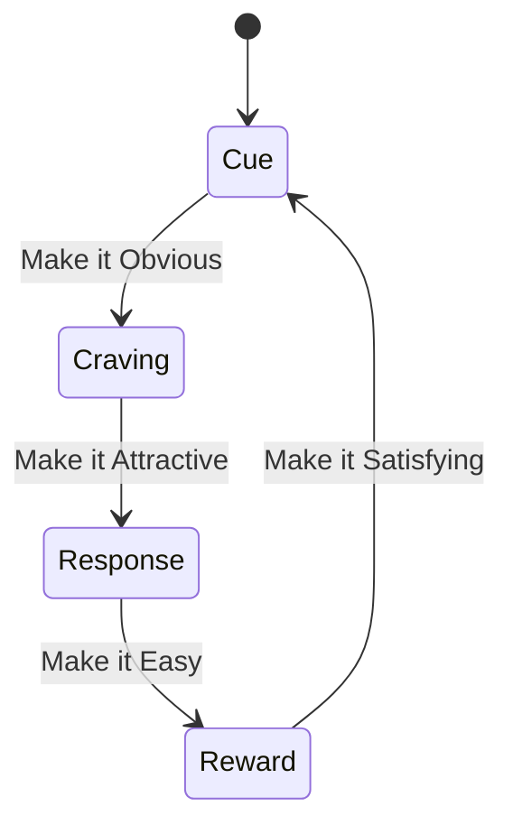

# Habits

The mechanism discipline runs on: a Cue → Craving → Response → Reward loop that compounds small actions into Identity.

## Building Habits

Small improvements compound. You do not rise to the level of your goals; you fall to the level of your systems.

- **Systems over goals.** Goals set direction; systems (daily processes) drive progress. Build repeatable processes, not outcome fantasies.
- **Identity over behavior.** Every action is a vote for who you become. "I am a runner" beats "I want to run." Change starts with who one takes oneself to be, not with motivation.
- **Compound over dramatic.** Embrace the Plateau of Latent Potential — results stay invisible long after the work starts.

**One habit at a time.** A batch of habits started together collapses together — starting several at once tends to end with none of them. Add the next only once the current one no longer needs remembering.

## The Habit Loop

Cue → Craving → Response → Reward.

Four laws to build good habits (invert to break bad ones):

| Law | Build | Break |
| --- | --- | --- |
| **Cue** | Make it Obvious — implementation intentions, habit stacking, environment design | Make it Invisible — remove cues |
| **Craving** | Make it Attractive — temptation bundling, join a culture where the behavior is normal | Make it Unattractive — highlight downsides |
| **Response** | Make it Easy — reduce friction, Two-Minute Rule, automate | Make it Difficult — add friction |
| **Reward** | Make it Satisfying — track streaks, immediate reinforcement, never miss twice | Make it Unsatisfying — add accountability |

The `Cue` column is where [Environment](06-environment.md) does its work: the cheapest way to make a habit obvious or invisible is to change what is in the room.

## Sources

- James Clear, "Atomic Habits" — the Cue/Craving/Response/Reward loop, the four laws, the Plateau of Latent Potential, the Two-Minute Rule, and systems-over-goals.
