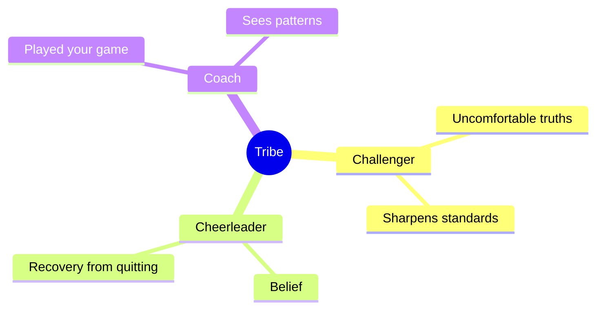

# Influence

Society improves two ways — constrain evil and compel good from outside, or work on yourself and provide the example. The second is primary.

## Conduct

The only thing that truly matters is having people you love and who love you.

| Principle | Practice |
| --- | --- |
| **Reliability** | Honor commitments consistently. Reputation is your most important asset — decades to build, a moment to destroy. |
| **Ownership** | Stop waiting for permission. Take responsibility for what is in your sphere even when it is not your fault; it builds confidence and control. |
| **Listening** | Ask more, talk less — real listening builds connection and insight faster than eager answering. Ask for advice rather than feedback; people are flattered and answer more usefully. |
| **Communication** | Find common language, navigate opposing viewpoints, share your vision clearly. |
| **Collaboration** | Accept criticism, resolve conflicts, keep the environment safe. |
| **Positive-sum** | The best way to win is to help the other person win; shared goals before personal ones. |
| **Equal dignity, differentiated merit** | People are equal in dignity and differ in mindset, conduct, and competence. Do not measure others by yourself. |
| **Ask** | You will get yes more often than you expect. |
| **Warm connections** | When in doubt, reach out and push past the awkwardness. A handwritten thank-you note every two weeks; gratitude compounds. |
| **Yes early, no later** | Youth favors yes, experience favors no: yes to opportunities, no to distractions. |
| **Humility** | Confidence without humility is arrogance; the combination makes someone worth following. |
| **Perspective** | Nobody is watching you as much as you think; everyone is focused on themselves. |

## Charisma

The distinctive attractiveness of an integrated person, arising through conscious recognition and acceptance of one's [shadow](34-identity.md#dark-shadow). It is the source of authenticity, creativity, and emotional depth, and it evokes interest, respect, inspiration — also fear.

It is not an innate gift but a trainable skill: **warmth + power + presence**. The body signals "avoid me" before a word is spoken, and the first impression forms in about 7 seconds.

| Move | How |
| --- | --- |
| **Eye contact** | Hold the gaze 60–70% of the conversation — 100% is interrogation, 30% reads as avoidance. Focus on the person's eye color to land the duration naturally. |
| **Pace and pauses** | Slow speech ~20%, pause ~1.5 seconds before answering, cut the fillers that fill a silence you fear. |
| **Posture** | Open shoulders, visible palms (an ancient "I'm safe" signal), chin level, take up space, long stride. |
| **Warmth first** | The brain checks "friend or foe" before "smart or not": a genuine Duchenne smile, the person's name twice, listening to understand rather than to reply. |
| **Low voice** | Breathe from the belly, end phrases on a falling intonation, keep volume near 70%, record yourself to correct delivery. |
| **Specifics** | Details, numbers, names, and smells build a mental picture; stories (situation → twist → lesson) are remembered about 22 times better than facts. |
| **Mirroring** | Mirror with a 2–3 second delay — never mimicry, never aggression. Leading mirroring pulls the other into your calm. |
| **Fewer words** | One thought, no apologies for existing ("glad we talked", not "thanks for hearing me out"). |
| **Status + vulnerability** | The strongest and most dangerous move: only after the first eight, one small sincere admission of weakness (the Pratfall effect). |

Charisma is intention plus repetition — add one move at a time.

## Persuasion

1. **Align to your audience** — start from their psychology, needs, and point of view; show how they benefit.
2. **Build credibility first** — authority before influence; never threaten their identity or predictability.
3. **Appeal to emotion and logic** — both systems drive decisions.
4. **Use clear, concise language** — complexity creates resistance.
5. **Provide evidence** — ground claims in concrete reality.
6. **Address counterarguments** — preemptive neutralization strengthens your position.
7. **Frame effectively** — context determines meaning.
8. **Create urgency** — motivate through relevance and time pressure.
9. **Repeat** — familiarity breeds acceptance.
10. **End with a clear call to action** — direct behavior explicitly.

## Elicitation

In five minutes of casual conversation you can learn someone's family dynamics, finances, personality type, and emotional patterns without asking directly. The structure stays invisible because the flow feels natural.

1. Ask questions, don't tell stories.
2. Validate their feelings: "I agree, I feel the same way."
3. Collect through open and closed questions.
4. Share only reflections — mirror what they have already told you.

**Emotional mirroring creates trust.** Reflect someone's state and they assume shared experience. Assess that state before engaging, and connect to whatever state they are in.

**Eye direction** (left-to-right readers): looking left accesses memory, looking right constructs or fabricates. Establish a baseline first — ask known-truth questions to see their pattern before concluding.

## Company and Norms

Norms are absorbed, not chosen. What counts as normal effort, normal income, normal ambition drifts toward the average of whoever you are in contact with most often — which makes the composition of that set a decision rather than an accident. If you are the smartest in the room, find a new room; do not work with toxic people regardless of talent.

- **Prune the permanent complaint.** Company that reads every outcome as done *to* them installs that reading in you: it is the [external locus](../7-mastery/02-mindset.md#accountability) arriving socially.
- **Your information diet is company too.** Channels, feeds, and podcasts fill the same slot as people and set the same norms, without the friction that would make you notice. Choose sources the way you would choose the room.

Three roles are worth keeping deliberately:

- **Challenger**: Tells uncomfortable truths. "What's one thing I can do better?"
- **Cheerleader**: Believes in you. Helps you recover when you'd otherwise quit.
- **Coach**: Already played your game. Sees patterns you can't.

