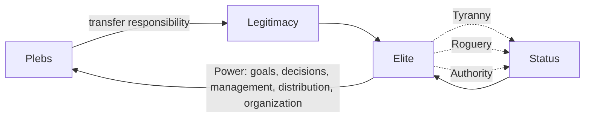

# Power Architecture

## The Power Ladder

**`Status`** := Capacity to impose one's will on the environment, against readiness to submit to another's.

---

**`Elite`** := The segment of society with the highest `Status` — those with direct access to `Power`.

---

**`Power`** := `Elite` status expressed through five functions: setting goals, making decisions, managing, distributing, organizing.

---

**`Plebs`** := The majority who trade portions of their rights and freedoms for security and stability.

---

**`Legitimacy`** := The recognition by the many of the `Elite`'s right to rule, granted by voluntary transfer of responsibility for one's fate.

### Three Paths to Status

| Path | Means |
| --- | --- |
| **Tyranny** | Direct violence or its threat |
| **Roguery** | Deception, manipulation, information advantage |
| **Authority** | Recognition earned through superior knowledge, skill, will, or character |

The transfer of responsibility that grants `Legitimacy` is [conformism](36-conformism.md) at the scale of a population.

An `Agent` who cannot be a threat is, to `Power`, a tool — axiom 6 of the [social contract](31-ecology.md#key-axioms).

## The State

**`Sovereign-State`** := Centralized, sovereign power over a defined territory, providing predictable rules of engagement, security enabling long-term cooperation, mechanisms for collective action, and formal bureaucratic procedure.

| Form | Definition |
| --- | --- |
| **Dictatorship** | Power held by one closed `Elite`, usually under a single boss. Personal rights are suppressed in favor of state or elite objectives, with no accountability mechanism |
| **Totalitarianism** | Rule through a single enforced ideology. All declare identical values, doubt is treated as crime, dissenters are corrected, isolated, or destroyed |
| **Nationalism** | Ideology placing one people's standing above all other values, splitting humanity into insiders and outsiders. Spreads by populist propaganda and black-and-white narratives |
| **Republic** | A state built on principles rather than expedience. Citizens grant `Legitimacy` in exchange for guaranteed rights, balance of interests, and stable development; elite power is bounded by the citizens' capacity to resist it, up to removing power that turns criminal. Participation is universal and equal |
| **Constitution** | The formal agreement between `Elite` and society — the supreme law. Defines shared values, goals, mutual rights and obligations, and commitment to human rights |
| **Nation** | A unity based on shared mentality, heritage, and culture — a cultural-psychological phenomenon, not a biological one |

## Instruments of Control

Power is held not only by force but by shaping the conditions under which the `Plebs` choose.

| Lever | How it works |
| --- | --- |
| **Narrative** | A unifying story — nation, enemy, emergency — that converts private lives into mobilized effort. A narrative of shared identity can ask the many to bear costs the few do not. See [Enemy Image](32-culture.md#enemy-image) |
| **Money** | Whoever defines the medium of exchange defines the limits of action. The more traceable the medium, the finer the possible control over what may be bought, saved, or refused |
| **Property** | Ownership confers independence; access — rent, lease, subscription — confers leverage to the owner. A population that owns little is more dependent on whoever owns the rest |
| **Risk** | Where danger is externalized downward, watch where those setting the terms place their own bodies and savings |

**Read the asymmetry, not the slogan.** In any crisis the question is *who bears the cost and who is insulated from it.* The slogan ("for the nation", "for your security") is the narrative lever; the asymmetry beneath it is the fact. Most such moves are ordinary incentives rather than plots, but power flows to whoever sets these terms, so a free person reads the terms before accepting them.
