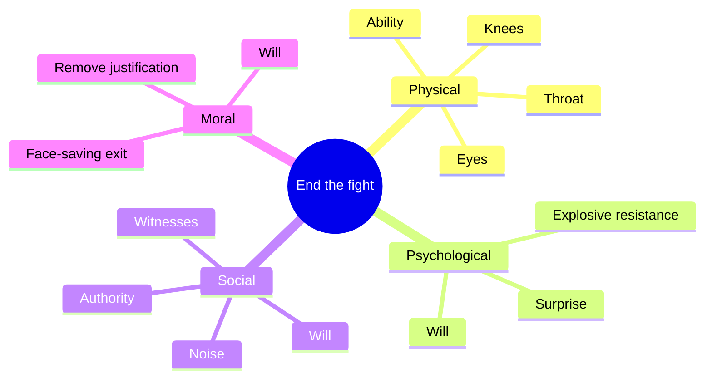

# Physical Security

Defense against violence. Most of it is won before contact; the fight is the rarest, costliest, least reliable layer.

The shared groundwork — mindset, awareness (Cooper's color code), the OODA loop, and the body under threat — lives in [Security → Foundations](05-security.md#foundations) and serves both the social and physical planes. [Recovery](05-security.md#recovery) after danger is shared too.

## Reading Threat

**Victim selection.** Predatory violence is rarely random — aggressors choose targets that look distracted, unaware, or unable to resist. Projecting calm alertness (upright posture, steady gait, brief eye contact, scanning) moves you out of the selection pool. Awareness is itself a deterrent.

**Pre-attack indicators** — behavioral cues that often precede an assault. None is proof; clusters and sudden shifts are the signal.

| Indicator | Reads as |
| --------- | -------- |
| **Target glance** | Checking you, then scanning for witnesses |
| **Closing the distance** | Unnecessary approach into your space |
| **Hidden / fidgeting hands** | Concealing a weapon or loading a strike |
| **Grooming / pacing** | Adrenaline leaking — face touching, weight shifting |
| **Sudden behavior change** | Calm flips to agitated, or agitated goes oddly calm |
| **Target-glancing at your body** | Selecting where to strike |

**Positioning and distance:**

- **Reactionary gap** — keep ~2 m (the "social zone"). Distance is time; time is options.
- **The fence** — open hands up at chest height: looks placating, guards your centerline, measures range.
- **Exits and cover** — know where they are before you need them. Keep your back uncommitted.

**De-escalation** — calm voice, non-threatening posture, no insults, no cornering. Give the other party a face-saving way out; most fights are about ego, and an exit defuses more than a challenge. Defending your pride is not self-defense.

## Fighting: Tactics & Technique

Only when escape is impossible. **The goal is not to win — it is to end the opponent's fight: make them *unable* to continue (ability) or *unwilling* to continue (will).** Either one buys the gap to escape. A fight you "win" but stay in is one you may lose to the next factor (a weapon, his friend, the ground).

A fight ends on whichever layer collapses first. There are four, and you can act on any of them:

| Layer | Breaks | Ways to end their fight |
| ----- | ------ | ----------------------- |
| **Physical** | Ability | Incapacitate the tools of fighting: vision (eyes), breath (throat, solar plexus), mobility (knees, balance). They cannot continue regardless of will — see [Targets](#fighting-tactics--technique) above. |
| **Psychological** | Will | Reverse the predator's expectation. Explosive resistance, surprise, and pain signal *wrong target, higher cost than planned*; the resolve that assumed an easy victim collapses. |
| **Social** | Will | Raise the audience cost. Witnesses, noise, allies, a crowd, approaching authority — being *seen* turns private dominance into public liability, and predators avoid attention. |
| **Moral** | Will | Remove the justification and offer an exit. Most violence runs on a story of being right or in control; give a face-saving way to stop, and the drive to continue dissolves — this is what [de-escalation](#reading-threat) buys. |

Physical force breaks *ability*; the other three break *will* — and will breaks faster and cheaper than bodies do, which is why most fights are decided before or without contact.

| Principle | Why |
| --------- | --- |
| **Gross motor over finesse** | Fine technique fails under adrenaline; palm strikes, elbows, knees, kicks survive |
| **Explosive commitment** | Half-effort invites escalation; act decisively or not at all |
| **Continuous until you can flee** | Strike → create space → run; don't stop to admire your work |
| **Use the environment** | Walls, doors, distance, improvised tools; level the asymmetry |
| **Stay off the ground** | Grappling is fatal against multiple attackers or weapons — stay mobile, upright |
| **Protect your head** | Hands up, chin down; the brain is the thing being defended |

**Targets** — strike where small force does large effect, to disrupt and disengage:

| Target | Effect |
| ------ | ------ |
| **Eyes** | Reflexive flinch, blurred vision — buys an exit |
| **Nose** | Pain, watering eyes, disorientation |
| **Throat** | Disrupts breathing — high effect, only against a genuine threat |
| **Solar plexus** | Winds the diaphragm, doubles them over |
| **Groin** | Pain and collapse, opening to run |
| **Knees** | Compromises mobility — they can't chase |

**Distance, weapons, numbers:**

- **Assume a weapon.** Watch the hands; create distance from anyone who reaches or hides them.
- **Multiple attackers** — never grapple; keep moving, keep them stacked behind one another, run.
- **Then escape** — strike, break contact, move toward light, people, and help. Call it in and report.

## Legal & Ethical Frame

Force is lawful only within limits (which vary by jurisdiction — this is not legal advice):

- **Imminence** — the threat must be happening or about to.
- **Reasonable belief** — a reasonable person would perceive danger.
- **Proportionality** — only as much force as needed; you can't answer a shove with lethal force.
- **Force ends when the threat ends** — pursuing once they're stopped or fleeing turns defense into assault.
- **Retreat** — some jurisdictions require retreating if safely possible; know your local law.

Ethically this mirrors [the prohibition on violence](../8-socium/30-socium.md#ethics): force is permitted in defense against oppression, never as imposition.

---

### Recovery

After danger on either plane, the adrenaline crashes: shaking, nausea, exhaustion, distorted memory. This is normal physiology, not weakness.

- **Immediate** — get to safety, let the shakes pass, breathe slowly to down-regulate the nervous system.
- **Physical** — treat injuries; the dump masks pain, so re-check later.
- **Psychological** — expect intrusive replay; talk it through, seek support if it persists. See [Vitality](01-vitality.md).

---

### Principles

1. The fight you avoid is the one you win.
2. Awareness is cheaper than technique, and stops more attacks — social or physical.
3. You don't rise to the occasion — you fall to your training. Train simple, train often.
4. Composure is the frame; distance is time; both are options.
5. Manipulation needs to stay invisible — naming it disarms it.
6. Speed serves the attacker. When in doubt, slow down.
7. A boundary without a consequence is a suggestion.
8. The goal is to get free, not to win. Force ends the instant the threat does.
9. Decide in advance; freezing is the failure to have pre-decided.
10. Dignity over convenience — you cannot buy peace at the cost of your own standing.

---

## Sources

- [Pre-attack indicators](https://www.cvpsd.org/post/how-to-use-pre-attack-indicators-as-a-signal-in-violent-situation); [reading body language for safety](https://www.randykinglive.com/blog/reading-the-room-how-body-language-can-keep-you-safer)
- [Vulnerable target areas](https://www.lvshaolin.com/what-are-the-most-vulnerable-parts-of-the-human-body-to-target-in-self-defense-situations/); [escape, not win](https://www.healthline.com/health/womens-health/self-defense-tips-escape)
- [Proportionality in self-defense law](https://www.cvpsd.org/post/proportionality-in-civilian-self-defense-what-it-means-and-why-it-matters)
- Shared foundations and recovery sources are listed in [Security](05-security.md#sources).
