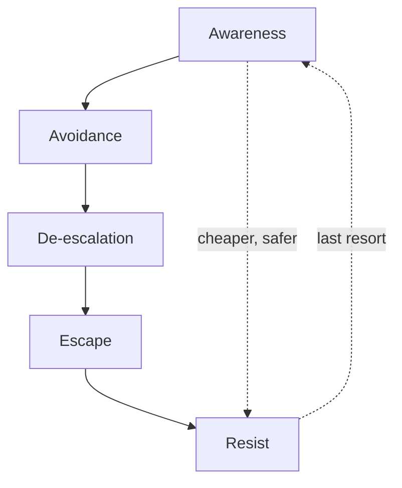
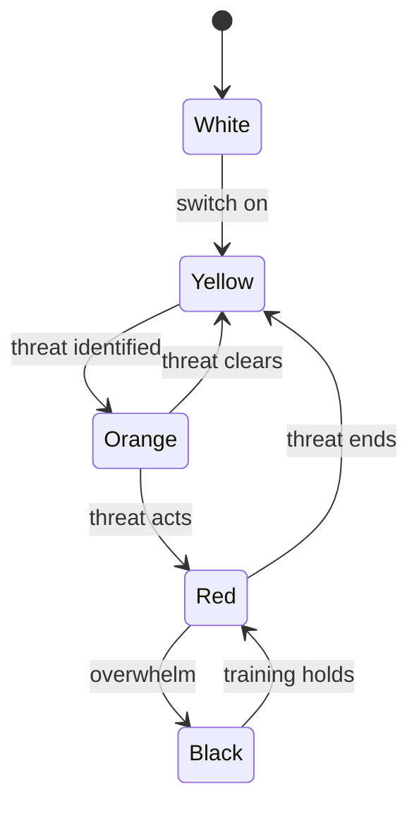
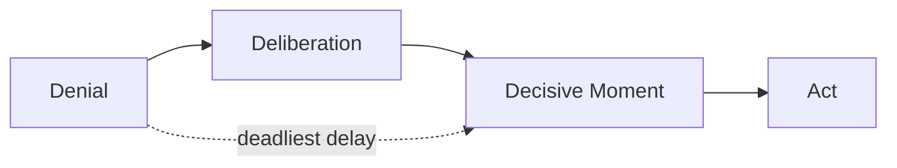

# SECURITY

Staying sovereign against threats from others, across two planes:

- **Social** — coercion, manipulation, boundary violation. The attack on your judgment and autonomy.
- **Physical** — intimidation and violence. The attack on your body.

Both rest on the same [Animal](../4-human/28-animal.md) that reacts before thought and the same [biases](../7-mastery/11-thinking.md) that get people hurt. Both are won mostly *before* contact. And both are **defense, not domination** — the goal is to stay intact and free, not to make others lose. See [Ethics](../8-socium/30-socium.md#ethics).

> The fight you avoid is the one you win. You don't rise to the occasion — you fall to the level of your training.

> **Note:** This page is educational. It is not legal advice or a fight manual. The lawful purpose of force is to stop an imminent threat and escape — nothing more.

### The Hierarchy of Defense

Options ranked by cost and reliability — identical on both planes. Spend your effort at the top; the bottom is failure management.

| Layer | Action | Goal |
| ----- | ------ | ---- |
| **Awareness** | Notice early | Buy time and options |
| **Avoidance** | Don't be there | Remove yourself from the setup |
| **De-escalation** | Lower the temperature | Give the other party an exit |
| **Escape** | Leave | Distance ends the threat |
| **Resist** | Hold the frame / proportional force | Create the chance to get free |

Resistance is the last resort, not the plan. Socially it means refusing and holding your line; physically it means proportional force to escape. Every layer above it is cheaper, safer, and more effective.

---

## Foundations

The ground shared by both planes. A manipulator and an assailant trigger the same nervous system and exploit the same hesitations.

#### Mindset

A **defensive mindset** is the decision, made in advance, that you are willing and able to act — so the choice is already made when seconds matter. Skill without the will to use it fails; will without skill flails. You need both.

#### Awareness — Cooper's Color Code

A scale of situational awareness, not paranoia. Live in Yellow — and the same scale applies to reading a room socially as to reading a street.

| Condition | State |
| --------- | ----- |
| **White** | Switched off, oblivious. The state victims are selected in. |
| **Yellow** | Relaxed alertness. Aware of surroundings, no specific threat. The baseline to live in. |
| **Orange** | A specific possible threat identified and watched. Forming a plan. |
| **Red** | Threat is real and acting. Execute the plan. |
| **Black** | Overwhelm/panic — the breakdown to avoid by training. |

#### The OODA Loop

**Observe → Orient → Decide → Act**, cycled continuously. Whoever runs the loop faster controls the encounter; a sudden, unexpected move *resets* the other side's loop and buys a window. A manipulator wins by keeping you reacting; so does an attacker. (John Boyd, USAF.)

#### The body under threat

Under threat the **sympathetic nervous system** floods the body with catecholamines (adrenaline, noradrenaline) — the **fight / flight / freeze / fawn** response. This is the [Stress and Fear](../4-human/28-animal.md) of the Animal made physical: it shuts down deliberation to mobilize the body. The same dump fires in a hostile negotiation as in a mugging.

| Effect | Consequence |
| ------ | ----------- |
| **Tunnel vision** | Peripheral sight narrows — you miss flanking threats and exits |
| **Auditory exclusion** | Sound drops out — you may not hear shouts or your own voice |
| **Tachypsychia** | Time distorts (slow-motion or compressed) |
| **Loss of fine motor control** | Fingers fail — anything requiring dexterity becomes unreliable |
| **Gross motor gain** | Large-muscle strength and pain tolerance spike |
| **Cognitive narrowing** | Hard to access complex, rehearsed-once responses |

**Implication:** train simple, repeatable responses — verbal and physical — that survive the dump. Complexity that works calm evaporates under stress. Repetition until automatic is the only thing that reliably transfers.

#### Biases that get you hurt

Why prepared people still freeze. Each is a [cognitive bias](../7-mastery/11-thinking.md) turned dangerous — and each stalls both the boundary you don't enforce and the exit you don't take.

| Bias | Failure it causes |
| ---- | ----------------- |
| **Normalcy bias** | "This can't be happening here" — warning signs downplayed |
| **Denial** | Refusing to register danger until it's too late to act |
| **Optimism bias** | "It won't happen to me" — no preparation, no plan |
| **Bystander effect** | In a crowd, everyone waits for someone else; no one acts |
| **Evaluation apprehension** | Fear of looking foolish overrides the instinct to refuse or flee |
| **Hick's Law** | Too many options slows the decision — choice itself causes freeze |

**The fixes:**

- **Pre-decision** — make if-then plans in advance ("if X, I say no / I exit there"). A decision already made is not subject to freeze.
- **Reduce choices** — a few trained defaults beat a large menu.
- **Rehearsal** — visualize and drill, so the decisive moment is recognition, not invention.
- **Act, don't poll the crowd** — name the danger and move; your action breaks others' freeze too.

In a crisis people pass through **denial → deliberation → decisive moment**. The faster you accept it is real, the sooner you act. The deadliest delay is the mind insisting "this isn't happening."

## Social Security

Defense against manipulation and coercion — the skills that keep you sovereign under pressure. This is the defensive half of [Influence](../8-socium/30-socium.md#influence).

Most people are trained from childhood to be *convenient* — to defer, soothe, and over-give for approval. The habit hardens into the **Rescuer**, who absorbs others' problems to feel needed, surrendering time, money, attention, and standing one concession at a time. It builds on the [Persona, Mask, and Shadow](../4-human/28-animal.md#persona).

### Frame

A **frame** is the implicit definition of "what is going on here" — the unspoken rules, roles, and stakes a situation is read through. Erving Goffman showed we never meet events raw; social life is a quiet contest over *whose* frame defines the moment.

**Whoever sets the frame sets the terms.** The stronger frame is rarely the loudest — it is the one that reacts least. Someone who needs the interaction to go a certain way has already handed control to whoever can withhold that outcome.

| Move | Method |
| ---- | ------ |
| **Non-reactivity** | Outcome independence. The less you need a specific result, the harder you are to move. Composure *is* the frame. |
| **Reframe** | Relabel the situation. "This isn't a demand, it's a request I can decline." Change the category and the rules change. |
| **Set the premise** | Define scope, terms, and agenda first. The one who states the question controls the answer. |
| **Calibrated questions** | Replace defense with inquiry: "How am I supposed to do that?" shifts the burden back without confrontation. |
| **Anchor** | The first number, standard, or expectation voiced becomes the reference point everything adjusts from. |

### Composure

Manipulation runs on **speed and pressure**. Slow the pace and most tactics lose their force. Silence is not a void to fill — it is leverage; the person comfortable with a pause controls its meaning.

| Pause | Use |
| ----- | --- |
| **The beat** | A deliberate two-second gap before answering. Nothing here can rush you. |
| **The drawn silence** | Four-plus seconds after the other side speaks. Pressure flows toward whoever is least comfortable with quiet. |
| **The decision pause** | "I'll get back to you." Removes the artificial urgency most demands depend on. |
| **The refusal pause** | A silence held *after* a "no," instead of rushing to soften it. |

Chris Voss's negotiation toolkit fits here as defense: **tactical empathy** (name the other side's state to defuse it, without conceding), **labeling** (naming an emotion lowers its charge), and the **accusation audit** (pre-empt the worst thing they could say about you so it loses its sting).

### Language

Speech leaks status. **Self-diminishing phrases** invite others to discount you before the content lands.

| Drop | Because |
| ---- | ------- |
| Reflexive apology ("Sorry to bother you…") | Apologizing for existing cedes ground. |
| Hedges ("just", "maybe", "I think possibly") | Qualifiers signal you expect to be overruled. |
| Permission-seeking ("Is it okay if I…") | Asking to be allowed concedes that the other decides. |
| Over-explaining | Volunteered justification is an opening to be argued with. |

**Saying no.** A clean refusal needs no defense. The trap is **JADE** — Justify, Argue, Defend, Explain — which reframes your decision as a proposal open to negotiation.

- **Broken record** — calmly repeat one clear refusal, unchanged, through resistance.
- **Fogging** — agree with any grain of truth in a jab without taking the bait ("You may be right that I'm cautious"), denying the aggression fuel.
- **"I" statements** — "I won't be able to do that" states a fact; it can't be debated like an opinion.

### De-escalation

[Composure](#composure) and [Manipulation & Defense](#manipulation--defense) handle covert pressure. **De-escalation** handles open aggression — someone already shouting, insulting, or threatening. The method here is George Thompson's *Verbal Judo*: a system for breaking aggression with words alone, built for police who cannot afford to lose control on the job.

**The mechanism it exploits.** An insult does not land on reason. It hits the [`Animal`](../4-human/28-animal.md) — the ancient guard that answers a threat with fight or flight before thought engages. Daniel Goleman named this the **amygdala hijack**: the reactive brain seizes the wheel and the deliberating brain goes briefly offline. Under it you are, plainly, dumber — the part that weighs and plans is switched off. This is why the perfect reply arrives at 2 a.m., hours after the fight, when deliberation finally comes back online to answer a question no longer being asked. See [the body under threat](#the-body-under-threat).

So a confrontation has two silent goals:

- **Keep your own deliberation online** — don't let your `Animal` take the wheel when you are struck.
- **Let the other side stay in reaction** — the one still thinking while the other emotes sets the terms.

Whoever keeps the deliberating brain working — not the guard — wins the exchange before the first word. A sudden, unexpected move also resets the other side's reaction (see [the OODA Loop](#the-ooda-loop)) and buys a window to lead.

**Judo, not karate.** Meeting force with force ("No, *you're* wrong") is verbal karate: the more stubborn, louder, angrier party wins, and usually both just crack heads. Judo accepts the force and redirects it — you don't become the wall the other expects to hit; you step alongside the push and steer it. Three principles carry the method:

| Principle | Karate (loses) | Judo (leads) |
| --------- | -------------- | ------------ |
| **React to the goal, not the insult** | Defend your ego; forget what you came for | The insult is bait — see past it to the [`Goal`](../2-mind/09-teleos.md). A short, near-empty *deflector* ("I hear you." / "I appreciate that.") strips the jab of force without swallowing it. |
| **Empathy as a tool, not kindness** | Throw arguments at someone who cannot hear them | Naming the other's state ("I understand why you're furious") releases the hijack and brings their thinking brain back. Empathy ≠ agreement; it is reconnaissance — see what drives them and where the lever is. |
| **Redirect, don't collide** | Pin them in front of others; demand they yield whole | Agree with the emotion, then steer the substance: "You're right to be angry — *that's exactly why* let's do this." Leave them an exit; a cornered person fights, one given a door walks through it. |

**Let them save face.** "You can have the last word; I get the last action." Let the other win the argument and you win the outcome — the result is what you came for, not the sentence.

Two formulas put the principles in order.

**LEAPS — taking an angry person down to a working conversation:**

| Step | Move |
| ---- | ---- |
| **Listen** | Hear what is said; don't load your reply while they speak — they feel it and escalate. |
| **Empathize** | Name the emotion aloud ("I see this matters to you"). This is the button that switches the thinking brain back on. |
| **Ask** | Questions pull them from feeling into fact — a thinking brain is no longer a shouting one. |
| **Paraphrase** | Restate their point in your words; they feel heard, you confirm you have it and soften the claim into workable form. |
| **Summarize** | Sum up and close on a concrete next step. |

**Voluntary compliance — getting a reluctant person to act by their own choice:**

| Step | Move |
| ---- | ---- |
| **Ask** | Request, don't command. Most people comply here if the ask is fair. |
| **Explain why** | A reason removes half the resistance; people do far more willingly what they understand. |
| **Give options** | Lay out the consequences of cooperating and not — good path appealing, bad path plain. They choose, so they comply without resentment. Pressure that feels like a free choice. |
| **Confirm** | "Is there anything I can say or do to get your cooperation?" One honest last chance, dignity intact. |
| **Act** | Only now, the consequence you named — without anger, without "I told you so." |

**Words that detonate.** Some phrases flip a conversation straight to a fight because each carries one of two messages — *your feelings are wrong* or *you are stupid* — a direct hit to the ego that triggers the hijack:

| Don't say | Why it explodes | Instead |
| --------- | --------------- | ------- |
| "Calm down" | Commands *and* judges the emotion as wrong | Name the state: "I can see this is serious." |
| "Come here" | A handler's order; the body resists before the mind knows why | "Can you come over for a second?" |
| "You wouldn't understand" | Says they aren't worth explaining to | Give the reason. |
| "Because those are the rules" | The same dismissal dressed as authority | "This is needed because…" |
| "What's your problem" / "What do you want me to do about it" | Writes the person off as a nuisance | Ask what outcome they want. |

> Whoever loses their temper in a conflict has already lost; the one who stays cold leads. This is not a trait you are born with — it is a trained muscle. Thompson himself was hot-tempered, and built the discipline that ends a fight with a word.

### Reading People

**Establish a baseline first.** Read how a person behaves when relaxed and truthful before reading anything into a single gesture. Deviation from *their own* baseline is the signal — not a universal "tell."

**The Dark Triad** — three overlapping, non-clinical traits sharing a callous-manipulative style:

| Trait | Surface | Core |
| ----- | ------- | ---- |
| **Narcissism** | Charm, grandiosity | Needs admiration; empathy absent |
| **Machiavellianism** | Strategic, smooth | Treats people as means; morality optional |
| **Psychopathy** | Bold, impulsive | No remorse; thrill over consequence |

**Counterpart types:**

| Type | Pattern | Hold your frame by |
| ---- | ------- | ------------------ |
| **Aggressor** | Volume, intimidation, scandal | Staying calm; refusing to match heat |
| **Manipulator** | Indirect, guilt, triangulation | Naming the move out loud |
| **Pressurer** | Manufactured urgency, ultimatums | Taking the decision offline |
| **Guilt-tripper** | "After all I've done…" | Separating gratitude from obligation |
| **Charmer** | Flattery, fast intimacy | Matching your pace, not theirs |
| **Victim-player** | Helplessness that recruits you | Declining the rescuer role |
| **Withdrawer** | Silent treatment, sulking | Not chasing; letting the cost sit with them |

**The second conversation.** Words are the most controlled thing a person owns — chosen, rehearsed, revised. The body runs on the older, faster [`Animal`](../4-human/28-animal.md) that reacts before deliberation engages (see [the body under threat](#the-body-under-threat)), so in the gap between impulse and mask the truth leaks. The leak is largest where the stakes are highest — money, loyalty, fault — because that is where the mask is held hardest. Read **deviation from baseline** across these channels, never a lone gesture:

| Channel | What leaks | How to read it |
| ------- | ---------- | -------------- |
| **Hands** | The least-watched honest channel after the eyes. Hidden palms, sudden self-touching (neck, collar, nose), one hand going still, an object gripped and turned. | Open palms and a gesture born *with* the word read as ease; concealment, or a gesture that lags the word it should ride, reads as effort. |
| **Pause** | The time taken to choose *which* version to give. | Compare the rhythm of a safe question to a loaded one. A sudden change of pace — stalling, or a too-smooth run — is the signal; long filler before a simple answer ("well, you see, sort of") buys time to compose. Honest answers usually stumble a little; rehearsed ones flow without a seam. |
| **Orientation** | Torso and feet point where attention — or the exit — really is; feet are the least-controlled part, because no one thinks about them. | A body squared to you and leaning in reads as real attention; feet turned to the door under warm words say the person has already left. A posture that *closes* on a specific topic marks that topic as sore. |
| **Eyes** | Pupil and blink shifts track arousal, not honesty. | Treat as weak signals only. The popular claim that gaze direction reveals lying (the NLP "eye-accessing" idea) has **no empirical support** — controlled studies fail to replicate it, and a practiced liar *over*-holds eye contact precisely because of the folklore. |
| **Incongruence** | The master signal: words say one thing while the body says another at the same moment. | When they disagree, weigh the channel the person controls least — the further from the face, the more honest. The clearest case is the smile that lives only on the mouth: a genuine one raises the cheeks and creases the eyes (the Duchenne marker) and arrives and fades slowly; a social one switches on at the lips like a lamp. The flash in the first half-second, before the managed expression, is the unedited reading. |
| **Behavior unobserved** | The base state, shown when the person stops performing. | Watch the face in the lulls, and how they treat someone useless to them — the waiter, the newcomer. Machiavelli's test: judge a person not by how they handle the strong but by how they treat those from whom they need nothing. |

**Rule of three.** One signal is a part, two a coincidence, three pointing the same way a pattern — the same arithmetic as [Hidden Hostility](#hidden-hostility). A signal is a prompt to look closer, never a verdict; treating every cue as proof is its own failure, as blinding as trust. The reverse skill — stripping these tells from your *own* behavior — is [Unreadability](#unreadability).

### Unreadability

Manipulation needs a **map** — a model of how you predictably react. The manipulator builds it quietly, often over months, before acting: without the map an attack is blind fire; with it, a single accurate shot. Most people never notice they were studied — they read the probing as interest. The counter, which Machiavelli drew from the courts he watched, is to deny the map: not coldness or concealment, but reactions an observer cannot reliably predict. He named its two faces — the **lion** to frighten wolves, the **fox** to see the trap.

**How you are read.** You hand over the map through four channels:

| Channel | What it leaks |
| ------- | ------------- |
| **Automatic reactions** | Every reflex — bristling at lateness, blooming at praise, rushing to explain a challenge — names a lever. The reaction is a window into what moves you. |
| **Volunteered disclosure** | Complaints show what stings; boasts show where you need recognition; the avoided topic marks the wound. People tell far more than they know. |
| **Behavior under pressure** | How you act when rushed, crossed, or criticized before others — the honest signal, because pressure drops the mask. Manipulators stage small pressure to watch it. |
| **Constancies** | What you always do in a given situation. Constancy is predictability, and predictability is the lever: stage the situation, harvest the response. |

The defense is not to become someone else but to strip the **predictability** from your reactions.

**The gap.** Put a pause between stimulus and response (see [Composure](#composure)). The manipulator bets on the automatic reaction; a pause steps out of the calculation and replaces a known answer with an unknown one. Uncertainty is the absence of a map.

**Graduated disclosure.** Information about yourself comes in three levels; release each by *proof*, not by warmth or by where the conversation drifts.

| Level | Contents | Release to |
| ----- | -------- | ---------- |
| **Public** | Work, basic facts, surface interests | Anyone — disclose widely |
| **Personal** | Views, values, important ties, past experience | Selectively, to those who have earned it |
| **Vulnerable** | Fears, doubts, the points that truly hurt | Only where loyalty is proven many times over |

Most people invert this — handing the lower levels too early and too wide, out of a wish to be understood or to grow close. **Proof of loyalty is conduct, not feeling**: a kept word, being spoken well of in your absence, being taken your side when it cost them, a confidence held and never used. Until the proof exists, stay at the public level — the caution the trustworthy understand, not coldness. (See [Boundaries → Information](#boundaries).)

**Deliberate variation.** Keep two kinds of consistency apart:

| Consistency | Verdict |
| ----------- | ------- |
| **Of values** | Keep it. Always holding your word and acting on your principles builds trust and reputation. |
| **Of reactions** | Break it. Always deflating at praise, always yielding to sustained pressure, always defending under criticism — each draws the map. |

So vary the response and leave the principle untouched: sometimes a plain "thank you" and a change of subject; sometimes an easy yes because this one does not matter; sometimes full agreement with a criticism that lands; sometimes laughter at a jab meant to wound. An observer who cannot predict you cannot aim at you, and most manipulators — who need a predictable target — move to easier ones; the hunt simply costs too much. This is [Conditioning](#conditioning) turned on its owner: what you no longer reliably give, no one can farm.

**Seeing it early, managing distance.** The early signals — manufactured urgency, praise out of proportion just before a request, a voice that isolates you from every other voice, and feeling reliably worse after contact — are the front edge of the [tactics and levers below](#manipulation--defense); caught small, each is cheap to neutralize. The response is rarely confrontation (the practiced manipulator is ready for it and turns it into your guilt — see [DARVO](#manipulation--defense)) nor an abrupt cutoff, but **managed distance**: gradually less disclosure, less time alone, less reliance, without announcement or quarrel. This is the [Relationship Audit](#relationship-audit) in motion — *proximity, not verdict*.

**In close ties.** Unreadability is not a wall against everyone; it is closure to those who would use you and openness to those who have earned it — chosen on proof, not extracted by being decoded. Among intimates it changes form: not reserve but **continued growth** — new thoughts, interests, and depths that keep a person never fully mapped, not because they hide but because there is always more. Two whole people each keeping their own center, disclosing as a process — reveal a little, watch how it is handled, reveal a little more — is partnership; one dissolving into the other is absorption, and both lose what was loved. The deepest closeness is not being read to the end, but being read with interest, year after year, and still finding more.

### Manipulation & Defense

Manipulation works by **hijacking the Animal** — triggering an emotional reflex (fear, guilt, urgency, belonging) so a decision is made before deliberation engages. Every tactic exploits a [cognitive bias](../7-mastery/11-thinking.md).

**The seven levers.** Cialdini's principles of influence are neutral tools — persuasion when honest, manipulation when concealed.

| Lever | Honest use | Exploited as |
| ----- | ---------- | ------------ |
| **Reciprocity** | Genuine give-and-take | Unsolicited "gifts" that manufacture debt |
| **Commitment / consistency** | Honoring your word | Foot-in-the-door: a small yes leveraged into a large one |
| **Social proof** | Learning from peers | "Everyone already agreed" |
| **Authority** | Deferring to real expertise | Borrowed credentials, intimidation by title |
| **Liking** | Real rapport | Flattery and forced similarity |
| **Scarcity** | True limits | Fake deadlines, "last chance" |
| **Unity** | Shared identity | "We're family — you owe us" |

**Tactics and their counters:**

| Tactic | How it works | Counter |
| ------ | ------------ | ------- |
| **Guilt** | Invokes duty to override judgment | "I understand, and my answer is the same." |
| **Fear of loss** | Threatens withdrawal of approval or access | Name the threat aloud; don't negotiate under it. |
| **Gaslighting** | Denies events to make you doubt your memory | Keep a written record; trust it over their narrative. |
| **Time pressure** | Forces a decision before you can think | "I don't decide on this timeline." Take it offline. |
| **False alternative** | Two bad options as if they're the only ones | Reject the menu: "Neither — here's a third." |
| **Ultimatum** | "Do this or else" | Treat "or else" as information; let them own it. |
| **Emotional blackmail** | Anger/tears/threats to control you | Stay regulated; their reaction is not yours to manage. |
| **Social proof** | "Everyone agrees / does this" | "Then it won't be hard to show me." |
| **Foot-in-the-door** | Small commitments escalated | Re-evaluate each ask; past yes ≠ obligation. |
| **Love bombing** | Overwhelming early praise to fast-track trust | Match the real pace; watch how they handle a slowdown. |
| **DARVO** | Deny, Attack, Reverse Victim and Offender | Don't defend the flip; restate the fact once, stop. |
| **Intermittent reinforcement** | Unpredictable reward/punishment hooks you | See the pattern, not the streak. |

**The universal counter** — almost every tactic dies to three steps:

- **gray rock**: minimal emotion, minimal information — nothing to work with.
- **name it** (manipulation needs to stay invisible),
- **slow it** (remove urgency),
- **hold the frame** (return to your position unchanged).

### Conditioning

Manipulation hijacks the `Animal` in a single moment;
**conditioning** shapes behavior across many.

Behavior is governed by its consequences, and *any predictable reaction you give is a consequence*. Comfort an outburst and you reward the outburst — it returns next week. Much of what is sold as "soft skills" is plain behavioral training: the same methods used to train animals work on people, because both run on the [Habit Loop](../7-mastery/05-habits.md#the-habit-loop) of cue and `Reward`.

You are conditioned whenever someone farms a reliable response out of you; you condition others by what you consistently reinforce — and attention itself is the `Reward`.

| Lever | How it shapes behavior | Defensive use |
| ----- | ---------------------- | ------------- |
| **Extinction (ignore)** | A behavior that earns no reaction fades, because the reward is removed. Expect a brief spike — an *extinction burst* — before it drops. | Withhold the payoff you've been handing over; don't mistake the burst for failure. |
| **Intermittent reward** | Unpredictable reinforcement hooks hardest — the schedule behind gambling. See [the tactic above](#manipulation--defense). | See the pattern, not the streak; a random payout is still bait. |
| **Timing** | A consequence binds only to what immediately precedes it. Delayed praise or rebuke attaches to nothing. | React while the act is live, not hours later; judge the action, not the person. |
| **One signal** | A request repeated without consequence teaches that your word carries no cost. | Say it once, then let the stated consequence follow — a [boundary](#boundaries) in motion. |
| **Shaping** | Complex behavior is built by rewarding small steps toward it, never demanded whole. | Notice when you're being walked toward a large concession one approving nod at a time. |
| **Pre-verbal cue** | People read your state — tone, pause, the first standard named — before your words. The `Anchor` and the [Frame](#frame) land first. | Watch what your composure signals; the message arrives before the sentence does. |

The defense is one rule: make your responses **deliberate, not reflexive**. What you react to, you train — so choose what you reinforce.

### Boundaries

A **boundary** is a stated limit on how you will be treated, paired with what you will do if it is crossed. Not a wall (shuts everyone out), not a wish (depends on their goodwill).

> A boundary without a consequence is a suggestion.

| Domain | Limit protects |
| ------ | -------------- |
| **Time** | Your hours and availability |
| **Attention** | What you let occupy your mind |
| **Body & space** | Physical proximity and contact |
| **Money** | Loans, gifts, shared costs |
| **Emotional labor** | Whose feelings you manage |
| **Values** | What you will and won't be party to |
| **Information** | What you disclose, and to whom |

A boundary is **statement + consequence + consistent enforcement**.

The consequence is yours to control ("then I'll leave the call"), never a threat to control them. Inconsistent enforcement teaches others the limit is negotiable.

### Hidden Hostility

**Ressentiment** (Nietzsche's term, borrowed from French for a feeling German had no word for) is suppressed malice — the hatred of someone who cannot strike openly and so poisons from cover. It never flows downward; no one resents the weaker. It runs upward, toward whoever lives better, holds firmer, or has achieved more. So hidden hostility in your circle is a backhanded compliment: someone has registered your advantage and could not bear it.

**Why it hides.** Open conflict is expensive. To declare a fight to your face stakes reputation and standing and invites a return blow — it is the move of someone who expects to win. The one who has weighed the odds and expects to lose takes the only weapon left to the weak: poison over sword, whisper over word, a smile over an honest look. Modern life makes this near-total — one open clash can cost a job or a circle, so aggression changes clothes and learns to ask after your health.

**The danger is access, not malice.** An open enemy is honest: you know where the blow comes from and can build a defense. A hidden one removes the ability to defend, because you do not guard against a friend — you seat them at your table, share your plans, hand over the weaknesses they store for later. Every fortress is unassailable outside and defenseless within.

**Against paranoia.** Not everyone you dislike is an enemy, and not every slight is a plan; tiredness, forgetfulness, and plain indifference are ordinary. The signal is a *repeating pattern*, not an instance — one case is chance, two is coincidence, the same signs over months and years are a signature. Read clusters and consistency over time, never a single gesture (see [Reading People](#reading-people)).

**The seven signs:**

| Sign | What it looks like | What it reveals |
| ---- | ------------------ | --------------- |
| **Silence at your win** | No acknowledgment when you succeed — or congratulation cut with a caveat ("lucky"; "let's see how long it lasts"). | To a well-wisher your win costs three seconds; to the resenter those seconds are punishment, because your success silently asks *why are you still in place?* The bigger your win, the smaller their words. |
| **Animation at your fall** | Comes alive at your failure — suddenly calls, suddenly has time; asks after the details of the wound. | Sympathy asks how it can help; **schadenfreude** feeds on the wound itself. The reward system (the same circuit that answers food and money) activates at an envied person's misfortune — the appetite is chemical. Read the energy, not the words. |
| **Aggression with an alibi** | The jab dressed as a joke, sealed with "can't you take a joke?" so you end up the guilty party. | A real joke unites; the disguised jab strikes a sore point precisely, which takes having studied where you hurt. It is worse before an audience, where lowering your status raises theirs. Test it: ask once, calmly, to drop it — a well-meaning person stops; the enemy waits a week and returns to the same spot. |
| **You exist only when needed** | Appears solely with a request; between times, silence and unanswered messages. | You are not a person to them but a function — a resource opened when something is wanted, locked until the next time. To use someone this way is quiet contempt for their time and worth. |
| **Care that devalues** | Concern in form, discouragement in substance: "I just don't want you to get hurt" attached to "you'll fail." | Real care helps you toward what you chose and lowers the risk; devaluing care turns you back. It guards not you from error but them from your success — your rise would make their stasis a verdict on themselves. Tell by how they act when you succeed anyway: the genuine admit they were wrong; the detractor forgets they spoke, or finds a new horizon of doom. |
| **Words and body disagree** | Good news told face-to-face draws a flicker — a brief stiffening, eyes cutting away — before the correct smile arrives. | Between an event and the managed reaction lies about half a second, and the truth lives there. In writing they can edit themselves; eye to eye they have only that half second. Excessive smoothness is itself the tell — genuine warmth is slightly unkempt, a played part too neat. |
| **The swing** | Warmth, then cold, with no cause in your behavior; you hunt for the mistake and find none. | Not weather but a leash: warmth dosed to keep you from leaving, cold to keep you unsure — holding you at a usable distance and busy decoding instead of living. Stable regard, even reserved and undemonstrative, marks a real tie; a place that lurches from near-family to near-stranger is a pattern about their game, not your acts. |

**The root.** Ressentiment is **desire plus powerlessness**. Wanting what you have — discipline, standing, calm — but unwilling to pay the price you paid, the psyche faces a choice: admit "he could, I could not," which hurts, or devalue the thing wanted. The fox that cannot reach the grapes calls them sour; only in life the fox stays by the vineyard and quietly works at the roots. The hatred is aimed at the mirror, not at you — your discipline indicts their slackness merely by existing, so you are hated not for any wrong but for the comparison. The seed sits in everyone (the half-second sting at another's win is universal); the difference is what is done with it — turned to fuel, or watered into a tree to live under.

**Response.** Three principles, after the Stoics:

| Principle | Method |
| --------- | ------ |
| **Observe, don't expose** | Confrontation is a dead end — no one admits "I want you to fail," so you end up the unhinged one while they enjoy the show. The power is in seeing; a seen enemy is half-disarmed. Then quiet arithmetic — less information, fewer plans, joys, and weaknesses in their ear; agreements in writing; outwardly unchanged, the once-open door now quietly closed. This is [gray rock](#manipulation--defense) applied to a relationship. |
| **Don't feed** | Hidden hatred lives on your reaction — your justifying, your bidding to finally be congratulated. Epictetus: only your thoughts, choices, and acts are yours; another's heart is not. Stop proving, stop explaining, stop carrying victories to someone who pointedly won't see them. Each gram of attention confirms their power over you (see [Conditioning](#conditioning): what you react to, you reinforce). |
| **Live so it goes powerless** | Marcus Aurelius: the best revenge is to be unlike the offender — not counter-plot or counter-whisper, but make results so undeniable that no whisper can diminish them. A whisper falls to facts, not to a louder shout. |

Hidden hatred is a **tax on growth**, paid by anyone who climbs a step above their surroundings; only the motionless are exempt. A circle with no detractors is not a circle of saints — more likely you have overtaken no one and mirrored no one. The aim is not to erase hidden hostility (impossible — it renews at every new level) but to **see it, refuse to feed it, and continue.** Closing the door on someone who came to salt your food is hygiene, not cruelty — which is the [Relationship Audit](#relationship-audit) that follows.

### Relationship Audit

Boundaries govern a single interaction; the **relationship audit** governs who gets access at all. Run it periodically on your circle — parasitic ties rarely announce themselves, they accrete.

| Read | Signal |
| ---- | ------ |
| **Direction of flow** | Do support, time, money, and attention move both ways, or only outward from you? |
| **Behavior in your need** | Allies show up when you have nothing to give; users surface only when you do. |
| **Cost of a "no"** | A sound tie survives refusal; a parasitic one punishes it — guilt, withdrawal, scandal. |
| **State after contact** | Notice whether you leave energized or drained. The body keeps the ledger. |

The response is **proximity, not verdict**: most ties need not a confrontation but less access. Demote, don't detonate — spend disclosure, time, and care on those who return them. This is [Boundaries](#boundaries) applied to the whole circle, and the antidote to the [Rescuer](#social-security).

---

### Sources

- Erving Goffman — [Frame Analysis](https://www.britannica.com/topic/frame-analysis) (1974)
- Robert Cialdini — [Influence: The Psychology of Persuasion](https://www.cognitigence.com/blog/cialdini-7-principles-of-persuasion); [Unity](https://news.wpcarey.asu.edu/20250422-gentle-science-persuasion-part-seven-unity)
- Chris Voss — [Never Split the Difference](https://grahammann.net/book-notes/never-split-the-difference-chris-voss) (2016)
- George J. Thompson — [Verbal Judo: The Gentle Art of Persuasion](https://en.wikipedia.org/wiki/Verbal_Judo) (LEAPS, voluntary compliance)
- Daniel Goleman — [the amygdala hijack](https://en.wikipedia.org/wiki/Amygdala_hijack)
- Paulhus & Williams — [The Dark Triad of Personality](https://en.wikipedia.org/wiki/Dark_triad) (2002)
- Manuel J. Smith — [When I Say No, I Feel Guilty](https://www.revolutionlearning.co.uk/article/the-fogging-technique/) (fogging, broken record)
- [The Gray Rock method](https://withtherapy.com/therapist-insights/mastering-the-gray-rock-method-for-effective-boundary-setting/); [DARVO](https://www.gaslightingcheck.com/blog/darvo-playbook); [manipulation tactics overview](https://www.selfemployed.com/the-manipulative-tactics-of-toxic-people-and-how-to-resist-them/)
- Jeff Cooper — [Color Code of Awareness](https://www.ammoland.com/2014/05/situational-awareness-color-codes-of-awareness/); John Boyd — [the OODA loop](https://concealedcarryclassdenver.com/2025/04/26/jeff-coopers-four-levels-of-awareness-with-ooda-loop-integration/)
- [Adrenaline dump](https://www.swatmag.com/article/adrenaline-dump-fight-or-flight/); [fight-flight-freeze-fawn](https://www.simplypsychology.org/fight-flight-freeze-fawn.html)
- [Normalcy bias](https://en.wikipedia.org/wiki/Normalcy_bias); [bystander effect](https://www.simplypsychology.org/bystander-effect.html)
- Friedrich Nietzsche — [ressentiment](https://en.wikipedia.org/wiki/Ressentiment) (On the Genealogy of Morals, 1887); Epictetus and Marcus Aurelius on the Stoic response. Source material: ["7 signs you are secretly hated — Nietzsche knew this 140 years ago"](https://www.youtube.com/watch?v=qb5fyfCGWPI)
- Niccolò Machiavelli — [The Prince](https://en.wikipedia.org/wiki/The_Prince) (the lion and the fox). *Unreadability* adapted from pasted source material on Machiavelli's strategy of unreadability (нечитаемость); no source URL was provided. The six-channel *second conversation* in [Reading People](#reading-people) is adapted from ["How to read people WITHOUT WORDS — 6 signals Machiavelli used to spot an enemy"](https://www.youtube.com/watch?v=fthSWvalpwE), with the eye-channel claims corrected against the empirical record.
