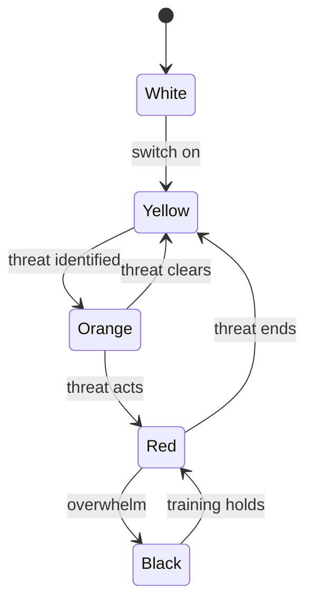

# Security

- **Social** — coercion, manipulation, boundary violation. The attack on your judgment and autonomy: [Frame](07-frame.md), [De-escalation](08-de-escalation.md), [Manipulation](09-manipulation.md), [Reading People](10-reading.md), [Hidden Hostility](11-hostility.md), [Boundaries](12-boundaries.md).
- **Physical** — intimidation and violence. The attack on your body: [Physical Security](13-defense.md).

Both rest on the same [Animal](../4-human/28-animal.md) that reacts before thought and the same [biases](../7-mastery/11-thinking.md) that get people hurt. Both are won mostly *before* contact. And both are **defense, not domination** — the goal is to stay intact and free, not to make others lose. See [Ethics](../8-socium/31-ecology.md#ethics).

*NOTE*: This page is educational. It is not legal advice or a fight manual. The lawful purpose of force is to stop an imminent threat and escape — nothing more.

## The Hierarchy of Defense

Options ranked by cost and reliability, identical on both planes. Spend your effort at the top; the bottom is failure management.

| Layer | Action | Goal |
| ----- | ------ | ---- |
| **Awareness** | Notice early | Buy time and options |
| **Avoidance** | Don't be there | Remove yourself from the setup |
| **De-escalation** | Lower the temperature | Give the other party an exit |
| **Escape** | Leave | Distance ends the threat |
| **Resist** | Hold the frame / proportional force | Create the chance to get free |

### Mindset

A **defensive mindset** is the decision, made in advance, that you are willing and able to act — so the choice is already made when seconds matter. Skill without the will to use it fails, and will without skill is not enough either. You need both.

## Situational Awareness — Cooper's Color Code

A scale of alertness, not paranoia. Live in Yellow — the same scale reads a room as well as a street.

| Condition | State |
| --------- | ----- |
| **White** | Switched off, oblivious. The state victims are selected in |
| **Yellow** | Relaxed alertness. Aware of surroundings, no specific threat. The baseline to live in |
| **Orange** | A specific possible threat identified and watched. Forming a plan |
| **Red** | Threat is real and acting. Execute the plan |
| **Black** | Overwhelm/panic — the breakdown to avoid by training |

## The OODA Loop

**Observe → Orient → Decide → Act**, cycled continuously. Whoever runs the loop faster controls the encounter; a sudden, unexpected move *resets* the other side's loop and buys a window. A manipulator wins by keeping you reacting; so does an attacker. (John Boyd, USAF)

## The Body Under Threat

Under threat the **sympathetic nervous system** floods the body with catecholamines — the **fight / flight / freeze / fawn** response. This is the [`Animal`](../4-human/28-animal.md#emotion-and-stress)'s `Stress` response made physical: deliberation shuts down to mobilize the body. The same dump fires in a hostile negotiation as in a mugging.

| Effect | Consequence |
| ------ | ----------- |
| **Tunnel vision** | Peripheral sight narrows — you miss flanking threats and exits |
| **Auditory exclusion** | Sound drops out — you may not hear shouts or your own voice |
| **Tachypsychia** | Time distorts (slow-motion or compressed) |
| **Loss of fine motor control** | Fingers fail — anything requiring dexterity becomes unreliable |
| **Gross motor gain** | Large-muscle strength and pain tolerance spike |
| **Cognitive narrowing** | Hard to access complex, rehearsed-once responses |

**Implication:** train simple, repeatable responses, verbal and physical, that survive the dump. Complexity that works calm evaporates under stress; only repetition until automatic transfers reliably.

## Biases That Get You Hurt

Why prepared people still freeze. Each is a [cognitive bias](../7-mastery/11-thinking.md) turned dangerous; the bystander effect is treated in [Conformism](../8-socium/36-conformism.md), and each stalls both the boundary you don't enforce and the exit you don't take.

| Bias | Failure it causes |
| ---- | ----------------- |
| **Normalcy bias** | "This can't be happening here" — warning signs downplayed |
| **Denial** | Refusing to register danger until it's too late to act |
| **Optimism bias** | "It won't happen to me" — no preparation, no plan |
| **Bystander effect** | In a crowd, everyone waits for someone else; no one acts |
| **Evaluation apprehension** | Fear of looking foolish overrides the instinct to refuse or flee |
| **Hick's Law** | Too many options slows the decision — choice itself causes freeze |

The fixes: **pre-decision** (if-then plans made in advance are not subject to freeze), **reduced choices** (a few trained defaults beat a large menu), **rehearsal** (so the decisive moment is recognition, not invention), and **acting rather than polling the crowd** (your move breaks others' freeze too).

In a crisis people pass through **denial → deliberation → decisive moment**. The deadliest delay is the mind insisting "this isn't happening."

## Recovery

After danger on either plane, the adrenaline crashes: shaking, nausea, exhaustion, distorted memory. This is normal physiology, not weakness.

- **Immediate** — get to safety, let the shakes pass, breathe slowly to down-regulate the nervous system.
- **Physical** — treat injuries; the dump masks pain, so re-check later.
- **Psychological** — expect intrusive replay; talk it through, seek support if it persists. See [Vitality](../9-vitality/02-vitality.md).

The ten [Principles Under Pressure](13-defense.md#under-pressure) are in [Physical Security](13-defense.md).

## Sources

- Jeff Cooper — [Color Code of Awareness](https://www.ammoland.com/2014/05/situational-awareness-color-codes-of-awareness/); John Boyd — [the OODA loop](https://concealedcarryclassdenver.com/2025/04/26/jeff-coopers-four-levels-of-awareness-with-ooda-loop-integration/)
- [Adrenaline dump](https://www.swatmag.com/article/adrenaline-dump-fight-or-flight/); [fight-flight-freeze-fawn](https://www.simplypsychology.org/fight-flight-freeze-fawn.html)
- [Normalcy bias](https://en.wikipedia.org/wiki/Normalcy_bias); [bystander effect](https://www.simplypsychology.org/bystander-effect.html)
