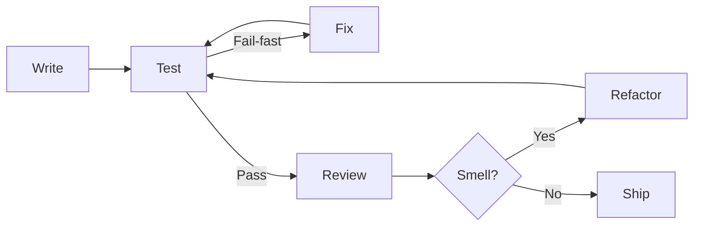
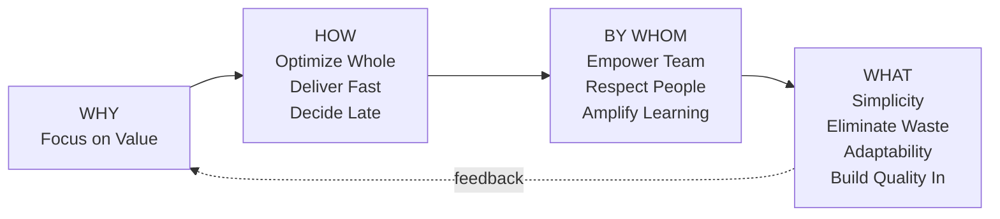

# Culture of Coding

## Code and Composability

**`Contract`** := Conditions and limitations that guarantee predictable runtime behavior; errors reported when violated.

---

**`Code`** := Text in some formal language interpreted by runtime as instructions for data transformations.

---

**`Referential Transparency`** := Ensuring an expression can be replaced with its value without changing program behavior.

---

**`Equivalence (≡)`** := Ensuring two expressions can be safely swapped in program text.

---

### Clean Code Principles

Clean code refers to writing code that is easy to understand and maintain by humans, not just computers.

| Principle | Description |
| ----------- | ------------- |
| **Simplicity** | Code should be as simple as possible; avoid unnecessary complexity |
| **Consistency** | Follow consistent coding style, design principles, patterns and best practices across the codebase |
| **Readability** | Code should be easily understandable using meaningful names and logical organization |
| **Comments/Documentation** | Explain WHY certain decisions were made, not HOW code works |
| **Error Handling** | Handle errors gracefully; anticipate potential failures (**Fail-fast**) |
| **Refactoring** | Regular refactoring improves structure without changing functionality |
| **Testing** | Clean code is testable; structure allows easy verification |
| **Performance/Stability** | Optimize for performance without compromising integrity |

## Design principles

**`Component`** := A named piece of code that can be combined with others to build complex components.

---
**`Composability`** := Ability of code to be combined into new, more complicated code.

### Principles of Composability

Composability is state-of-art, and system design should follow correct
Contracts around Separation, Ownership, and Responsibility:

1. **Encapsulation**: Encapsulate tightly cohesed own state necessary and sufficient for its duty
2. **Delegation**: Be responsible for one single duty; delegate all other functions outside
3. **Single Language**: Operate on well-defined glossary concepts providing a single layer of abstraction
4. **Server, not Service**: Communicate with outer context via pre-defined Contract in loosely coupled way

### Abstraction and Composition

| Principle | Description |
| ----------- | ------------- |
| **Abstraction Principle** | Each significant piece of functionality should be implemented in just one place |
| **Separation of Concerns (SoC)** | Separate program into distinct features with minimal overlap |
| **GRASP** | General Responsibility Assignment Software Patterns |
| **S.O.L.I.D.** | Five principles of object-oriented design |
| **Inversion of Control** | Custom code receives flow of control from a generic framework |
| **Uniform Access Principle** | All services should be available through uniform notation |
| **Principle of Least Astonishment** | Component should behave as most users expect it to |
| **Law of Demeter** | A method should only call methods of its immediate collaborators |

### SOLID Principles

*SOLID principles aim to reduce module changes to addition and removal, supporting deferring technical decisions and dividing labor.*

| Letter | Principle | Description |
| -------- | ----------- | ------------- |
| **S** | Single Responsibility | An entity should be concerned with only one function; should have only one reason to change from a single business role |
| **O** | Open/Closed | An entity should be open for extension, but closed for modification |
| **L** | Liskov Substitution | A typed object should be replaceable with instances of their subtypes without altering correctness |
| **I** | Interface Segregation | Make fine-grained interfaces that are client specific |
| **D** | Dependency Injection | One should depend upon abstractions, not concretions |

### Minimalism

| Principle | Description |
| ----------- | ------------- |
| **Hollywood Principle** | "Don't call us, we'll call you" |
| **80:20 Rule** | Focus on the 20% that produces 80% of results |
| **Don't Repeat Yourself (DRY)** | Every piece of knowledge should have a single, unambiguous representation |
| **KISS Principle** | Keep It Simple, Stupid |
| **Worse is Better** | Simple implementation is more important than complete functionality |
| **YAGNI** | You Aren't Gonna Need It - don't implement until necessary |
| **Rule of Least Power** | Use the least powerful language suitable for the purpose |

## Lean Architecture

Lean Architecture is derived from principles of Lean Thinking and Lean Manufacturing,
primarily used in software development, systems design, and enterprise architecture.

**Focus**: Maximizing value, minimizing waste, creating systems that are adaptable, scalable, and aligned with business goals.

> *"Think big, act small, fail fast; learn rapidly"*

### Key Principles

#### WHY

| Principle | Description |
| ----------- | ------------- |
| **Focus on Value** | Prioritize delivery of value to end-user; ensure every aspect of design adds value |

#### HOW

| Principle | Description |
| ----------- | ------------- |
| **Optimize the Whole** | Architecture should not be optimized in isolation but as part of a larger system |
| **Deliver as Fast as Possible** | Deliver customer value early and continuously; shorten time to market; enable fast feedback loops |
| **Decide as Late as Possible** | Avoid making decisions too early; remain open to change and new information (Last Responsible Moment) |

#### BY WHOM

| Principle | Description |
| ----------- | ------------- |
| **Empower the Team** | Trust collective wisdom; foster collaboration between architects, developers, operations, and stakeholders |
| **Respect for People and Culture** | People are at the heart; foster continuous improvement; respect insights of all involved |
| **Collaboration and Communication** | Promote close collaboration and open communication among all stakeholders |
| **Integrated Project Delivery (IPD)** | Integrate people, systems, business structures to optimize results and reduce waste |
| **Amplify Learning** | Build architecture encouraging fast feedback and learning; involve stakeholders early |
| **Continuous Improvement** | Encourage culture where feedback and lessons enhance future processes |

#### WHAT

| Principle | Description |
| ----------- | ------------- |
| **Simplicity** | Design systems as simple as possible while meeting business needs; reduce complexity |
| **Eliminate Waste** | Identify and remove wasteful elements: unnecessary features, redundant systems, overly complex structures |
| **Flexibility and Adaptability** | Design for change; systems should be modular, decoupled, able to evolve with minimal disruption |
| **Build Quality In** | Quality embedded from the beginning; systems designed to be robust, maintainable, easy to evolve |

## Code Smells

### Naming Conventions

| Smell | Description |
| ------- | ------------- |
| **Excessively Long Identifiers** | Using naming conventions for disambiguation that should be implicit |
| **Excessively Short Identifiers** | Names should reflect function unless obvious |
| **Excessive Use of Literals** | Should be coded as named constants; externalize to resource files |

### Application-Level Smells

| Smell | Description |
| ------- | ------------- |
| **Spaghetti Code** | Structure barely comprehensible due to misuse of code structures |
| **Duplicated Code** | Identical or similar code in more than one location |
| **Contrived Complexity** | Forced usage of overcomplicated design patterns |

### Class-Level Smells

| Smell | Description |
| ------- | ------------- |
| **Large Class (God Object)** | A class that has grown too large |
| **Feature Envy** | A class using methods of another class excessively |
| **Inappropriate Intimacy** | A class depending on implementation details of another |
| **Refused Bequest** | A class overriding methods that break the base class contract |
| **Lazy Class** | A class that does too little |
| **Cyclomatic Complexity** | Too many branches or loops |

### Method-Level Smells

| Smell | Description |
| ------- | ------------- |
| **Too Many Parameters** | Hard to read, calling and testing complicated |
| **Long Method** | A method that has grown too large |
| **Excessive Return of Data** | Returning more than each caller needs |

### Design Smells

| Smell | Description |
| ------- | ------------- |
| **Missing Abstraction (Primitive Obsession)** | Using clumps of data or encoded strings instead of creating abstraction |
| **Multifaceted Abstraction** | Abstraction with multiple responsibilities |
| **Duplicate Abstraction** | Two or more abstractions with identical names or implementation |
| **Deficient Encapsulation** | Declared accessibility more permissive than required |
| **Unexploited Encapsulation** | Using explicit type checks instead of exploiting polymorphism |
| **Broken Modularization** | Data/methods that should be localized are separated |
| **Insufficient Modularization** | Abstraction not completely decomposed |
| **Cyclically-dependent Modularization** | Two or more abstractions depend on each other |

### See also

- **Zen of Python**: Principles guiding Python design
- **Unix Philosophy**: Simple, modular, composable programs
- **List of Software Development Philosophies**: Various guiding principles
