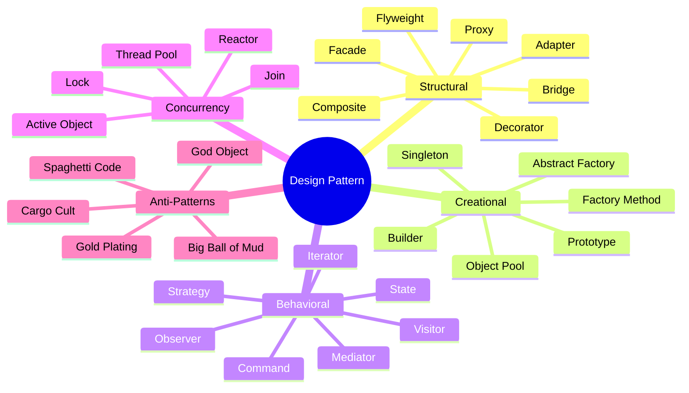

# Design Pattern

**`Sesign pattern`** := a generalized approach addressing frequently occurring problems.

It is a template for how to solve a problem that can be used in many different situations.

A design pattern isn't a finished design that can be transformed directly into code.

## Structural Patterns - Prominent

| Pattern | Short Description | Goal/Issue/Problem |
| --------- | ------------------- | ------------------- |
| **Adapter** | Wrapping own interface around an existing class | Allows existing classes with incompatible interfaces to work together. Convert the interface of a class into another interface clients expect. |
| **Bridge** | Decouples an abstraction from its implementation | "Hardening of the software arteries" has occurred by using subclassing. Use interfaces instead of subclassing abstract classes. |
| **Facade** | A single class representing simplified view of an entire complex subsystem | Client needs simplified interface to overall functionality of complex subsystem. Provide unified interface to a set of interfaces. |
| **Proxy** | Provides a placeholder for another object with the same interface | To control access, reduce cost, and reduce complexity. |
| **Decorator** | Adds/changes behavior in an existing method at runtime | Attach additional responsibilities dynamically keeping the same interface. Flexible alternative to subclassing. |

## Structural Patterns - Others

| Pattern | Description |
| --------- | ------------- |
| **Module/Namespace** | Group several related elements into a single conceptual entity |
| **Composite/Node** | Compose objects into tree structures for part-whole hierarchies |
| **Flyweight** | Use sharing to support large numbers of similar objects efficiently |
| **Front Controller** | Provides centralized entry point for handling requests in web applications |
| **Twin** | Multiple inheritance in languages that don't support it |
| **Marker/Tag** | Empty interface to associate metadata with a class |

## Creational Patterns

*Creational patterns create objects for you, rather than having you instantiate objects directly, giving more flexibility in deciding which objects need to be created.*

| Pattern | Description |
| --------- | ------------- |
| **Abstract Factory** | Create families of related or dependent objects without specifying concrete classes |
| **Factory Method** | Define interface for creating objects, but let subclasses decide which classes to instantiate |
| **Object Pool** | Recycle objects no longer in use to avoid expensive acquisition and release of resources |
| **Builder** | Separate the construction of a complex object from its representation |
| **Prototype** | Specify kinds of objects using a prototypical instance, create new objects by copying |
| **Singleton** | Ensure a class has only one instance, provide global point of access |
| **Multiton** | Ensure a class has only named instances |
| **Lazy Initialization** | Delay creation of an object until first needed |
| **RAII** | Ensure resources are properly released by tying them to lifespan of suitable objects |

## Behavioral Patterns - Prominent

*Most are specifically concerned with communication between objects, to decouple senders and receivers.*

| Pattern | Description |
| --------- | ------------- |
| **Iterator** | Access elements of an object sequentially without exposing underlying representation |
| **Observer** | One-to-many dispatching of changes of 'subject' across arbitrary observers |
| **Pub/Sub** | Indirect Observers via EventBus |
| **State** | Allow an object to alter its behavior when its internal state changes |
| **Visitor** | Represent an external operation to be performed on elements of an object structure |
| **Chain of Responsibility** | Chain receiving objects and pass request along until an object handles it |
| **Command** | Encapsulate a request as an object to parameterize clients with different requests |
| **Mediator** | Define interface for communication between objects; objects delegate interaction to mediator |

## Behavioral Patterns - Exotic

| Pattern | Description |
| --------- | ------------- |
| **Servant** | Define common functionality for a group of classes |
| **Strategy** | Family of interchangeable algorithms selected on-the-fly at runtime |
| **Memento** | Capture and externalize an object's internal state for later restoration (undo) |
| **Interpreter** | Implement a specialized language; define representation for grammar |
| **Template Method** | Define skeleton of algorithm as abstract class; subclasses provide concrete behavior |
| **Null Object** | Avoid null references by providing a default object |
| **Specification** | Recombinable business logic in Boolean fashion |

## Concurrency Patterns

| Pattern | Description |
| --------- | ------------- |
| **Lock** | Thread puts "lock" on a resource, preventing other access |
| **Active Object** | Decouple method execution from invocation in their own thread of control |
| **Balking** | Only execute an action when object is in a particular state |
| **Thread Pool** | Number of threads performing tasks usually organized in a queue |
| **Binding Properties** | Combine observers to force properties to be synchronized |
| **Blockchain** | Decentralized way to store data and agree on processing in a Merkle tree |
| **Double-checked Locking** | Reduce overhead of acquiring a lock by first testing in an unsafe manner |
| **Guarded Suspension** | Manage operations requiring both lock and precondition |
| **Join** | Write concurrent, parallel, distributed programs by message passing |
| **Reactor** | Provide asynchronous interface to resources handled synchronously |

## Anti-Patterns

### Software Design Anti-Patterns

| Anti-Pattern | Description |
| -------------- | ------------- |
| **Big Ball of Mud** | A system with no recognizable structure |
| **Abstraction Inversion** | Not exposing implemented functionality required by callers |
| **Gold Plating** | Continuing work well past the point where extra effort adds value |
| **Inner-Platform Effect** | A system so customizable it becomes a poor replica of the development platform |
| **Interface Bloat** | Making an interface so powerful it is extremely difficult to implement |

### OOP Anti-Patterns

| Anti-Pattern | Description |
| -------------- | ------------- |
| **Anemic Domain Model** | Domain model without business logic; validation/mutation logic placed elsewhere |
| **God Object** | Concentrating too many functions in a single class |
| **Object Orgy** | Failing to properly encapsulate objects, permitting unrestricted access |
| **Poltergeists** | Objects whose sole purpose is to pass information to another object |
| **Yo-yo Problem** | Structure (e.g., inheritance) hard to understand due to excessive fragmentation |

### Programming Anti-Patterns

| Anti-Pattern | Description |
| -------------- | ------------- |
| **Cargo Cult Programming** | Using patterns and methods without understanding why |
| **Spaghetti Code** | Programs whose structure is barely comprehensible |
| **Lasagna Code** | Programs with too many layers of inheritance |
| **Magic Numbers** | Including unexplained numbers in algorithms |
| **Repeating Yourself** | Writing code with repetitive patterns; avoid with DRY principle |
| **Shotgun Surgery** | Adding features spanning multiple implementations in a single change |
