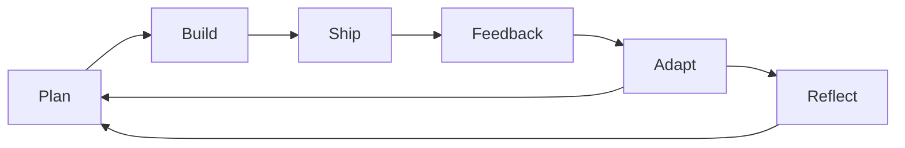
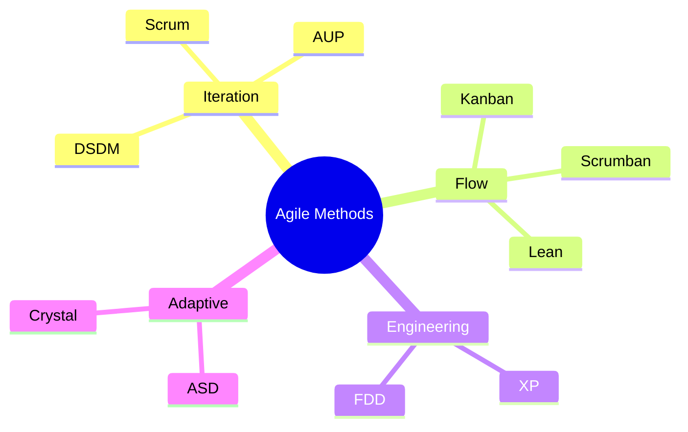

## Agile Methodology

**Agile** is a software development process that encourages rapid and flexible response to change, where requirements and solutions evolve continuously and empirically through collaboration between self-organizing, cross-functional teams.

### Core Concepts

| Concept | Description |
| --------- | ------------- |
| **Requirements Volatility** | Unpredicted challenges during production: customers changing minds, evolving technologies, market changes |
| **Empirical Approach** | Accepting the problem cannot be fully understood before start; focusing on maximizing ability to deliver while adapting to feedback and challenges |
| **Method Tailoring** | Process where human agents determine system development approach for a specific project situation |

### Agile Values

| Value | Description |
| ------- | ------------- |
| **Individuals and Interactions** | Over processes and tools. Self-organization and motivation are important; co-location and pair programming. |
| **Working Software** | Over comprehensive documentation. Working software is more useful than documents in meetings. |
| **Customer Collaboration** | Over contract negotiation. Requirements cannot be fully collected at beginning; continuous stakeholder involvement. |
| **Responding to Change** | Over following a plan. Focused on quick responses to change and continuous development. |

### The Agile Manifesto (12 Principles)

1. Customer satisfaction by early and continuous delivery of valuable software
2. Welcome changing requirements, even in late development
3. Working software is delivered frequently (weeks rather than months)
4. Close, daily cooperation between business people and developers
5. Projects are built around motivated individuals, who should be trusted
6. Face-to-face conversation is the best form of communication (co-location)
7. Working software is the principal measure of progress
8. Sustainable development, able to maintain a constant pace
9. Continuous attention to technical excellence and good design
10. Simplicity - the art of maximizing the amount of work not done - is essential
11. Best architectures, requirements, and designs emerge from self-organizing teams
12. Regularly, the team reflects on how to become more effective, and adjusts accordingly

### Agile Practices

| Practice | Description |
| ---------- | ------------- |
| Design-Driven Development | - |
| Acceptance Test-Driven Development (ATDD) | - |
| Behavior-Driven Development (BDD) | Specification by example |
| Iterative and Incremental Development (IID) | - |
| Test-Driven Development (TDD) | Continuous test-driven development |
| Extreme Programming (XP) | Pair programming |
| Agile Modeling | - |
| Cross-Functional Team | - |
| Continuous Integration (CI) | - |
| Information Radiators | Scrum board, task board, visual management board, burndown chart |
| Refactoring | - |
| Agile Testing | - |
| Timeboxing | - |
| User Story | Story-driven modeling |

### Agile Methods

- **Scrum**
- Kanban
- Scrumban
- Agile Unified Process (AUP)
- Dynamic Systems Development Method (DSDM)
- Lean Software Development
- Extreme Programming (XP)
- Feature-Driven Development (FDD)
- Adaptive Software Development (ASD)
- Crystal Clear Methods

