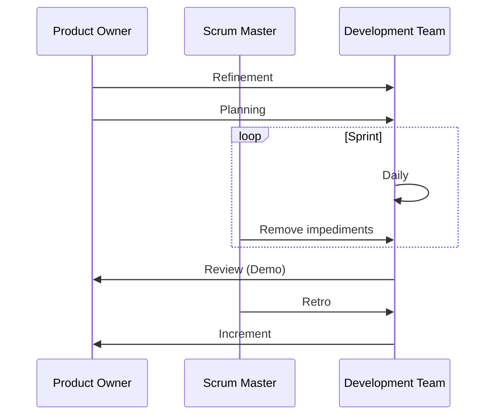
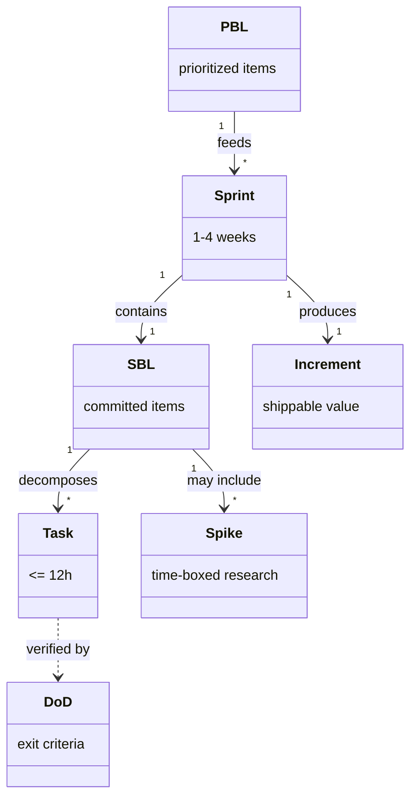

## Scrum Framework

### What is Scrum?

**Scrum** is a lightweight framework that helps to
generate value through adaptive solutions for complex problems.

It's about managing the process of development, delivery, and sustaining of products that:

- Respects an empirical approach to address complex adaptive problems and requirement volatility
- Strives to deliver properly tested product increments of the highest possible value within short iterations
- Employs transparency, inspection, and adaptation to optimize predictability and control risk
- Emphasizes self-organized, high-performing team that values commitment, courage, focus, openness, and respect

### The Scrum Team

| Role | Description |
| ------ | ------------- |
| **Product Owner** | Person representing interests of stakeholders, responsible for maintaining product backlog and ensuring value of work |
| **Scrum Master** | Servant-leader helping everyone understand Scrum theory, practices, rules, and values; responsible for process and maximizing benefits |
| **Development Team** | Cross-functional group working together toward common goals; responsible for delivering Increments at end of every sprint |

### Scrum Ceremonies

1. **Daily** - Daily standup meeting
2. **Planning** - Sprint planning session
3. **Refinement** - Backlog grooming
4. **Review (Demo)** - Sprint review/demonstration
5. **Retro** - Sprint retrospective

### Scrum Artifacts

| Artifact | Description |
| ---------- | ------------- |
| **Sprint Burn-down Chart** | Daily progress for a sprint over the sprint's length |
| **Release Burn-down Chart** | Feature level progress of completed product backlog items |
| **Product Backlog (PBL)** | A prioritized list of high-level requirements |
| **Sprint** | A time period (typically 1-4 weeks) in which development occurs on a set of backlog items committed by team |
| **Sprint Backlog (SBL)** | A prioritized list of tasks to complete during the sprint |
| **Tasks** | Work items added to sprint backlog; usually take a day to finish, should not exceed 12 hours (two days) |
| **Spike** | A time-boxed period used to research a concept or create simple prototype |
| **Definition of Done (DoD)** | Exit-criteria to determine whether a backlog item is complete |
| **Increment** | Sum of all Product Backlog items completed during a Sprint and value of all previous Sprints |

### Estimation Concepts

| Concept | Description |
| --------- | ------------- |
| **Story Point** | A COMPOSITE, RELATIVE, SUBJECTIVE measure unit estimating "overall" size of work: expected effort, team skills, uncertainties, QA, workflow overheads |
| **Velocity** | Total effort a team is capable of in a sprint; derived from work completed in last sprint's backlog items; guides future sprint planning |
