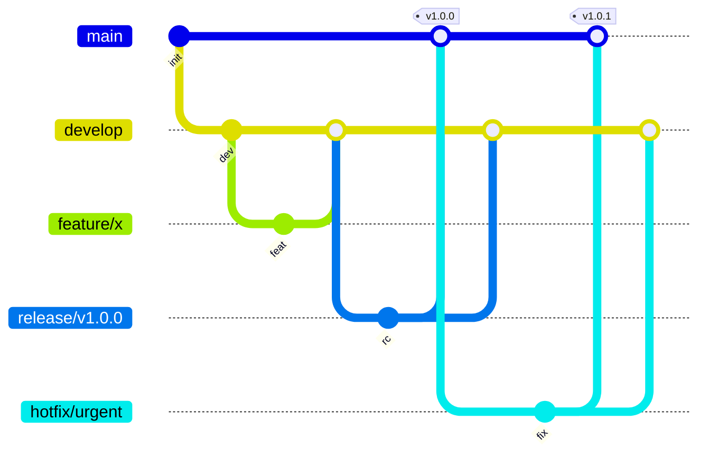
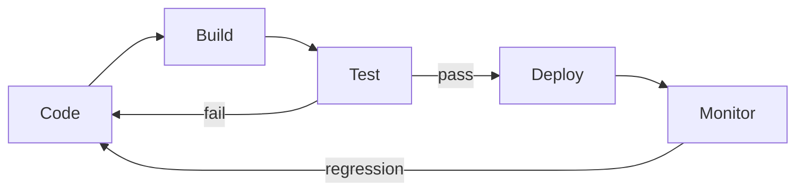
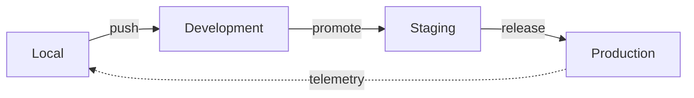

# Development Process


---

## Code Review

Code review catches bugs early, shares knowledge, and enforces standards.

**Checklist:**

```markdown
### Functionality
- [ ] Does the code do what it's supposed to?
- [ ] Are edge cases handled?

### Readability
- [ ] Are names descriptive?
- [ ] Is there unnecessary duplication?

### Testing
- [ ] Are there tests for new functionality?
- [ ] Do tests cover edge cases?

### Security
- [ ] Is user input validated and sanitized?
- [ ] Are secrets handled securely?

### Performance
- [ ] Are there unnecessary computations?
- [ ] Is memoization used where needed?
```

**Feedback guidelines:**

| Approach | Example |
| --- | --- |
| Be specific | "Consider using `map` instead of `forEach` here" |
| Explain why | "Using `const` prevents accidental reassignment" |
| Suggest alternatives | "This could use a reducer pattern" |
| Acknowledge good code | "Great solution for this edge case!" |
| Ask questions | "What was the reasoning behind this approach?" |

---

## Version Control

### GitFlow

Branching model for features, releases, and hotfixes.

```text
main (production)
  │
  │  develop (integration)
  │    │
  │    ├── feature/feature-name → merge back to develop
  │    │
  │    └── release/v1.0.0 → tag & merge to main + develop
  │
  └── hotfix/urgent-fix → merge to main + develop
```

| Branch | Purpose | Lifetime |
| --- | --- | --- |
| `main` | Production-ready code | Permanent |
| `develop` | Integration branch | Permanent |
| `feature/*` | New features | Until merged |
| `release/*` | Release preparation | Until released |
| `hotfix/*` | Urgent production fixes | Until merged |



```bash
# Start a new feature
git checkout develop && git checkout -b feature/new-feature

# Update with latest
git fetch origin && git rebase origin/develop

# Complete feature
git checkout develop
git merge --no-ff feature/new-feature
git branch -d feature/new-feature

# Create release
git checkout -b release/v1.0.0
git checkout main && git merge --no-ff release/v1.0.0
git tag -a v1.0.0 -m "Release v1.0.0"
git checkout develop && git merge --no-ff release/v1.0.0
```

### Pull Request Template

```markdown
## Description
Brief description of changes

## Type of Change
- [ ] Bug fix
- [ ] New feature
- [ ] Breaking change
- [ ] Documentation update

## Testing
Describe the testing approach

## Checklist
- [ ] Self-reviewed
- [ ] Tests pass locally
- [ ] No new warnings
- [ ] Documentation updated
```

---

## Debugging

### Chrome DevTools

| Panel | Purpose | Shortcut |
| --- | --- | --- |
| Elements | DOM inspection | Ctrl+Shift+C |
| Console | JavaScript execution | Ctrl+Shift+J |
| Sources | JS debugging, breakpoints | Ctrl+Shift+P → Sources |
| Network | Request analysis | Ctrl+Shift+E |
| Performance | Profiling | Ctrl+Shift+P → Performance |
| Application | Storage and resources | Ctrl+Shift+P → Application |

**Debugging techniques:**

```javascript
function processData(data) {
    const result = data.map(item => item.value * 2);

    // Conditional breakpoint: result.length > 100
    debugger;

    return result;
}

// Console utilities
console.table(array);                          // Tabular view
console.group('Group'); console.groupEnd();    // Grouped logs
console.time('op'); console.timeEnd('op');     // Timing
console.trace('Here');                         // Stack trace
console.assert(condition, 'msg');              // Assertions
```

---

## CI/CD

Automates integration and deployment: Code → Build → Test → Deploy → Monitor.



| Aspect | CI | CD |
| --- | --- | --- |
| Focus | Code integration | Automated deployment |
| Goal | Detect integration issues | Deploy to production |
| Frequency | Every commit | After CI passes |
| Tools | GitHub Actions, Jenkins | Argo CD, Spinnaker |

### Environment Stages

| Environment | Purpose | Data |
| --- | --- | --- |
| Local | Individual development | Mocked/sample |
| Development | Integration testing | Test database |
| Staging | Pre-production testing | Production-like |
| Production | End users | Real data |

Staging mirrors production to catch environment-specific issues before release.



---

## References

1. [GitFlow Workflow](https://nvie.com/posts/a-successful-git-branching-model/)
2. [GitHub Actions Documentation](https://docs.github.com/en/actions)
