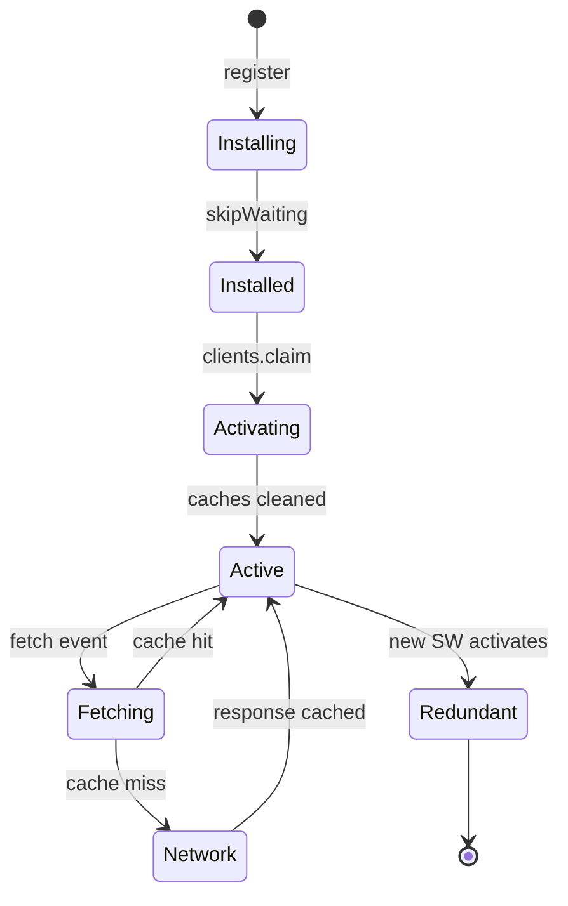
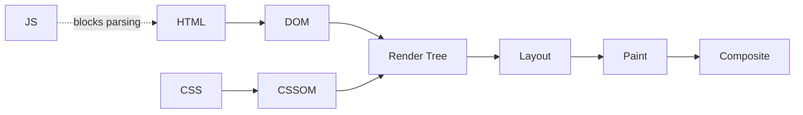
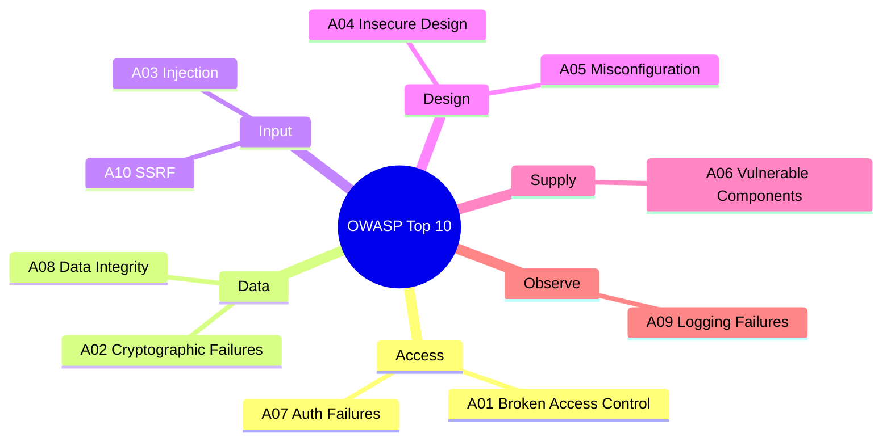
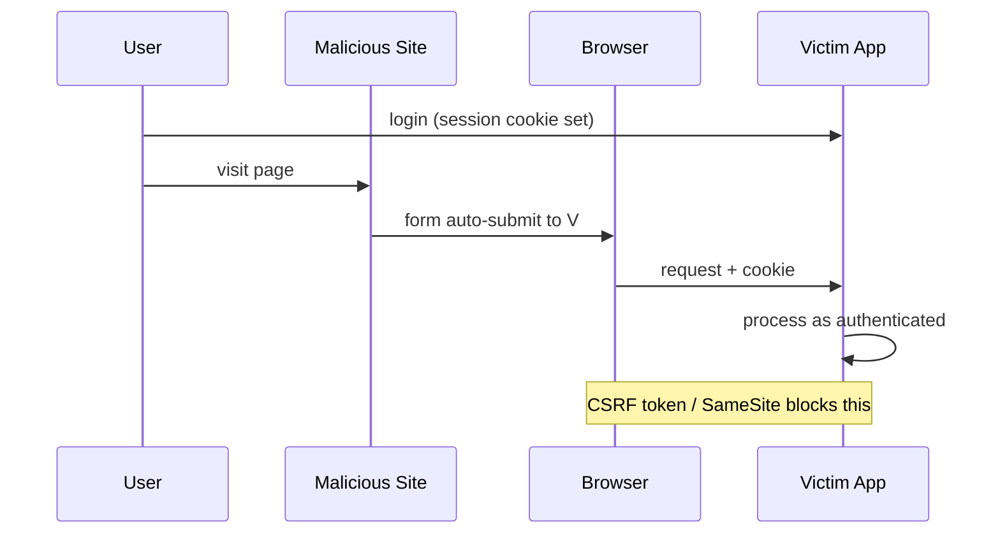

# Frontend


---

# Web Application Fundamentals

## Application Types

### Single-Page Applications (SPA)

SPAs update the current page without full reloads, providing app-like navigation.

| Characteristic | Description |
| --- | --- |
| Initial Load | Downloads full application bundle |
| Navigation | Client-side routing, no page reloads |
| Data Fetching | API calls for dynamic content |
| SEO | Requires SSR or pre-rendering |

### Progressive Web Applications (PWA)

PWAs are installable web apps with offline support.

| Feature | Implementation |
| --- | --- |
| Installable | Web App Manifest |
| Offline Support | Service Workers |
| Push Notifications | Push API |
| Background Sync | Background Sync API |
| Secure | Required HTTPS |

**Web App Manifest:**

```json
{
    "name": "My PWA App",
    "short_name": "PWA App",
    "start_url": "/",
    "display": "standalone",
    "theme_color": "#4a90d9",
    "icons": [
        { "src": "/icons/icon-192.png", "sizes": "192x192", "type": "image/png" },
        { "src": "/icons/icon-512.png", "sizes": "512x512", "type": "image/png" }
    ]
}
```

**Service Worker (cache-first with network fallback):**

```javascript
const CACHE_NAME = 'my-pwa-cache-v1';
const STATIC_ASSETS = ['/', '/index.html', '/styles/main.css', '/scripts/app.js'];

self.addEventListener('install', (event) => {
    event.waitUntil(caches.open(CACHE_NAME).then(cache => cache.addAll(STATIC_ASSETS)));
    self.skipWaiting();
});

self.addEventListener('activate', (event) => {
    event.waitUntil(
        caches.keys().then(names =>
            Promise.all(names.filter(n => n !== CACHE_NAME).map(n => caches.delete(n)))
        )
    );
    self.clients.claim();
});

self.addEventListener('fetch', (event) => {
    event.respondWith(
        caches.match(event.request).then(response => response || fetch(event.request))
    );
});
```



---

## Data Formats

### JSON

The dominant web data exchange format.

```json
{
    "users": [
        {
            "id": 1,
            "name": "John Doe",
            "email": "john@example.com",
            "active": true,
            "scores": [95, 87, 92]
        }
    ],
    "total": 1,
    "page": 1
}
```

| Vulnerability | Prevention |
| --- | --- |
| JSON Injection | Input validation |
| DoS via large payload | Size limits |
| Prototype Pollution | Deep clone, freeze objects |
| XSS via `eval()` | Always use `JSON.parse()` |

Use CORS instead of JSONP (JSONP is XSS-vulnerable).

### XML

Still relevant for enterprise systems and document formats.

```xml
<?xml version="1.0" encoding="UTF-8"?>
<users>
    <user id="1">
        <name>John Doe</name>
        <email>john@example.com</email>
    </user>
</users>
```

---

## Client-Server Communication

### HTTP

| Method | Idempotent | Safe | Description |
| --- | --- | --- | --- |
| GET | Yes | Yes | Retrieve resource |
| POST | No | No | Create resource |
| PUT | Yes | No | Replace resource |
| PATCH | No | No | Partial update |
| DELETE | Yes | No | Delete resource |

| Code Range | Category | Examples |
| --- | --- | --- |
| 2xx | Success | 200 OK, 201 Created, 204 No Content |
| 3xx | Redirection | 301 Moved, 304 Not Modified |
| 4xx | Client Error | 400 Bad Request, 401 Unauthorized, 404 Not Found |
| 5xx | Server Error | 500 Internal Error, 502 Bad Gateway |

### REST

Uses HTTP semantics for API design. Resources identified by URI, stateless requests.

```text
GET    /api/users           # List
GET    /api/users/123       # Get one
POST   /api/users           # Create
PUT    /api/users/123       # Replace
DELETE /api/users/123       # Delete

GET /api/users?role=admin&active=true    # Filter
GET /api/users/123/posts                 # Relationship
```

### GraphQL

Clients request exactly the data they need — no over- or under-fetching.

```graphql
query GetUsers {
    users(first: 10) {
        id
        name
        posts { title }
    }
}

mutation CreateUser($input: CreateUserInput!) {
    createUser(input: $input) {
        id
        name
        errors { field message }
    }
}
```

| Aspect | REST | GraphQL |
| --- | --- | --- |
| Endpoints | Multiple | Single |
| Over-fetching | Common | None |
| Type safety | Optional | Built-in |
| Caching | Native HTTP | Requires setup |

### WebSockets

Bidirectional real-time communication over a persistent TCP connection.

```javascript
const socket = new WebSocket('wss://api.example.com/ws');

socket.onopen = () => socket.send(JSON.stringify({ type: 'SUBSCRIBE', channel: 'updates' }));
socket.onmessage = (event) => console.log('Received:', JSON.parse(event.data));
socket.onclose = (event) => console.log('Disconnected:', event.code);
socket.onerror = (error) => console.error('Error:', error);

socket.close(1000, 'Done');
```

| Technology | Use Case | Browser Support |
| --- | --- | --- |
| WebSockets | Bidirectional real-time | Excellent |
| Server-Sent Events | Server-to-client streaming | Good |
| Long Polling | Fallback | Universal |

---

## Browser Technologies

### DOM

The DOM represents the page as a tree of nodes that JavaScript can manipulate.

| Operation | Performance |
| --- | --- |
| `getElementById` | Fastest |
| `querySelector` | Fast |
| `textContent` | Fast |
| DOM creation | Slow — minimize, use fragments |
| Layout thrashing | Very slow — batch reads then writes |

```javascript
// Bad - multiple reflows
elements.forEach(el => { const h = el.offsetHeight; el.style.height = (h + 10) + 'px'; });

// Good - batch reads then writes
const heights = Array.from(elements).map(el => el.offsetHeight);
elements.forEach((el, i) => { el.style.height = (heights[i] + 10) + 'px'; });

// Use fragment for bulk inserts
const fragment = document.createDocumentFragment();
for (let i = 0; i < 100; i++) {
    const div = document.createElement('div');
    div.textContent = `Item ${i}`;
    fragment.appendChild(div);
}
document.body.appendChild(fragment);
```

### Events

Events bubble from target up to Window (capture phase goes the other direction).

**Event delegation** — attach one listener to the parent instead of many to children:

```javascript
document.getElementById('list').addEventListener('click', (event) => {
    if (event.target.classList.contains('item')) {
        handleItemClick(event);
    }
});
```

### Browser Storage

| Storage | Capacity | Expiration | Scope |
| --- | --- | --- | --- |
| Cookie | 4KB | Configurable | All frames |
| localStorage | 5–10MB | Never | Same origin |
| sessionStorage | 5–10MB | Tab close | Same tab |
| IndexedDB | Hundreds of MB | Never | Same origin |

```javascript
// localStorage
localStorage.setItem('user', JSON.stringify({ name: 'John' }));
const user = JSON.parse(localStorage.getItem('user'));
localStorage.removeItem('user');

// IndexedDB
const request = indexedDB.open('MyDatabase', 1);
request.onupgradeneeded = (event) => {
    const db = event.target.result;
    const store = db.createObjectStore('users', { keyPath: 'id' });
    store.createIndex('email', 'email', { unique: true });
};
```

---

## CSS Fundamentals

### Box Model

Each element is a rectangular box: content → padding → border → margin.

Use `box-sizing: border-box` so width/height include padding and border.

### Flexbox

```css
.container {
    display: flex;
    flex-direction: row;
    justify-content: space-between;
    align-items: center;
    flex-wrap: wrap;
    gap: 16px;
}

.item {
    flex: 1;        /* grow: 1, shrink: 1, basis: 0 */
    flex-grow: 1;
    flex-shrink: 0;
    flex-basis: 200px;
}
```

### Grid

```css
.container {
    display: grid;
    grid-template-columns: repeat(3, 1fr);
    gap: 20px;
    grid-template-areas:
        "header header header"
        "sidebar main main"
        "footer footer footer";
}

.header { grid-area: header; }
.sidebar { grid-area: sidebar; }
```

### Responsive Design (Mobile-First)

```css
/* Base (mobile) */
.container { padding: 16px; }

/* Tablet */
@media (min-width: 768px) {
    .container { padding: 24px; display: grid; grid-template-columns: 200px 1fr; }
}

/* Desktop */
@media (min-width: 1024px) {
    .container { max-width: 1200px; margin: 0 auto; }
}
```

---

## HTML5

### Semantic Elements

Use `<header>`, `<nav>`, `<main>`, `<article>`, `<section>`, `<aside>`, `<footer>` to describe content meaning.

### Form Enhancements

```html
<input type="email" required autocomplete="email">
<input type="url" pattern="https://.*">
<input type="number" min="0" max="100" step="1">
<input type="date" min="2024-01-01">
<input type="file" accept=".pdf,.doc">
<input type="text" required minlength="3" maxlength="50">
```

---

## WCAG (Accessibility)

| Principle | Description |
| --- | --- |
| **Perceivable** | Content presentable in ways users can perceive |
| **Operable** | UI components must be operable |
| **Understandable** | Information and operation must be clear |
| **Robust** | Content works with assistive technologies |

```html
<!-- Live region for dynamic updates -->
<div aria-live="polite" aria-atomic="true">Status: {{ message }}</div>

<!-- Hidden decorative icon with label -->
<button aria-label="Close dialog">
    <span aria-hidden="true">&times;</span>
</button>

<!-- Image with extended description -->

<p id="chart-details">Detailed description...</p>

<!-- Expandable control -->
<button aria-expanded="false" aria-controls="menu">Menu</button>
<div id="menu" hidden><!-- Menu content --></div>
```

---

## Browser APIs

### Fetch API

```javascript
async function getUsers() {
    try {
        const response = await fetch('https://api.example.com/users', {
            method: 'POST',
            headers: { 'Content-Type': 'application/json', 'Authorization': `Bearer ${token}` },
            body: JSON.stringify({ name: 'New User' })
        });
        if (!response.ok) throw new Error(`HTTP error! status: ${response.status}`);
        return await response.json();
    } catch (error) {
        console.error('Fetch error:', error);
        throw error;
    }
}
```

### Geolocation API

```javascript
navigator.geolocation.getCurrentPosition(
    (position) => {
        console.log('Lat:', position.coords.latitude);
        console.log('Lng:', position.coords.longitude);
    },
    (error) => console.error('Error:', error),
    { enableHighAccuracy: true, timeout: 5000 }
);

// Watch position
const watchId = navigator.geolocation.watchPosition(
    pos => console.log(pos),
    err => console.error(err)
);
navigator.geolocation.clearWatch(watchId);
```

---

# Frontend Performance

## Core Web Vitals

Google's key metrics for user experience and search ranking.

| Metric | Measures | Good | Poor |
| --- | --- | --- | --- |
| **LCP** (Largest Contentful Paint) | Render time of largest visible element | ≤2.5s | >4s |
| **INP** (Interaction to Next Paint) | Responsiveness to interactions | ≤200ms | >500ms |
| **CLS** (Cumulative Layout Shift) | Visual stability during load | ≤0.1 | ≥0.25 |

## Performance Budgets

| Metric | Target |
| --- | --- |
| Total page weight | <500KB compressed |
| HTTP requests | <50 |
| JavaScript bundle | <200KB gzipped |
| Time to Interactive | <3.5s |
| First Contentful Paint | <1.8s |
| Critical CSS | <14KB |

---

## Rendering Optimization

### Critical Rendering Path

Browser steps: HTML parsing → DOM → CSSOM → Render tree → Layout → Paint → Composite.

CSS is render-blocking; scripts block parsing unless `async`/`defer`.



```javascript
// Inline critical CSS for above-fold content
const criticalCSS = `
    .header { display: flex; background: #fff; }
    .hero { min-height: 100vh; }
`;

// Defer non-critical CSS
<link rel="preload" href="/styles/main.css" as="style"
      onload="this.onload=null;this.rel='stylesheet'">
<noscript><link rel="stylesheet" href="/styles/main.css"></noscript>
```

### Layout Thrashing

Occurs when the browser recalculates layout repeatedly because reads and writes interleave.

```javascript
// Bad - read/write alternating causes repeated reflows
elements.forEach(element => {
    const height = element.offsetHeight;    // Read (triggers layout)
    element.style.height = (height + 10) + 'px'; // Write
});

// Good - batch reads then batch writes
const heights = Array.from(elements).map(el => el.offsetHeight);
elements.forEach((element, i) => {
    element.style.height = (heights[i] + 10) + 'px';
});
```

| Category | Layout-Triggering Properties |
| --- | --- |
| Dimensions | width, height, padding, margin, border |
| Position | top, right, bottom, left |
| Metrics | offsetWidth, offsetHeight, getBoundingClientRect |

### Paint and Composite

Only animate `transform` and `opacity` — they skip layout and paint, running on the GPU.

```css
/* Good - GPU-accelerated */
.animated { transform: translateX(100px); opacity: 0.5; }

/* Bad - triggers layout */
.animated { width: 200px; left: 100px; background-color: red; }

/* Promote to own layer for complex animations */
.hero { will-change: transform; }
```

---

## Network Optimization

### HTTP Caching

| Resource Type | Cache Policy | Max Age |
| --- | --- | --- |
| HTML | No-cache (validate) | 0, must-revalidate |
| CSS/JS (versioned) | Long-term | 1 year |
| Images (versioned) | Long-term | 1 year |
| API responses | Short | 60–300 seconds |
| User-specific data | No cache | 0 |

```http
Cache-Control: max-age=3600, s-maxage=86400, stale-while-revalidate=60
ETag: "abc123"
Vary: Accept-Encoding
```

**Service Worker stale-while-revalidate:**

```javascript
self.addEventListener('fetch', (event) => {
    event.respondWith(
        caches.open(CACHE_NAME).then(async (cache) => {
            const cached = await cache.match(event.request);
            const fetchPromise = fetch(event.request).then(response => {
                cache.put(event.request, response.clone());
                return response;
            });
            return cached || fetchPromise;
        })
    );
});
```

### Resource Hints

```html
<!-- Preload critical resources -->
<link rel="preload" href="/scripts/main.js" as="script">
<link rel="preload" href="/fonts/inter.woff2" as="font" crossorigin>

<!-- DNS prefetch for third-party domains -->
<link rel="dns-prefetch" href="https://api.example.com">

<!-- Preconnect to origins -->
<link rel="preconnect" href="https://cdn.example.com" crossorigin>

<!-- Prefetch likely next pages -->
<link rel="prefetch" href="/dashboard" as="document">
```

### Script Loading

```html
<!-- Default (blocks parsing) -->
<script src="main.js"></script>

<!-- Async - downloads in parallel, executes immediately -->
<script src="analytics.js" async></script>

<!-- Defer - executes after HTML parsing -->
<script src="app.js" defer></script>

<!-- Module (implicitly deferred) -->
<script type="module" src="module.js"></script>
```

### Image Optimization

| Format | Best For |
| --- | --- |
| WebP | General use (lossy/lossless) |
| AVIF | Next-gen, better compression |
| SVG | Icons and graphics |

```html
<!-- Responsive with srcset -->


<!-- Explicit dimensions prevent CLS -->


<!-- Format fallback -->
<picture>
    <source srcset="image.avif" type="image/avif">
    <source srcset="image.webp" type="image/webp">
    
</picture>
```

---

## JavaScript Performance

### Code Splitting

```javascript
// Static import (bundled upfront)
import HeavyComponent from './HeavyComponent';

// Dynamic import (loaded on demand)
const HeavyComponent = () => import('./HeavyComponent');

// React.lazy with Suspense
const Dashboard = lazy(() => import('./Dashboard'));

function App() {
    return (
        <Suspense fallback={<Loading />}>
            <Routes>
                <Route path="/dashboard" element={<Dashboard />} />
            </Routes>
        </Suspense>
    );
}
```

### Memory Leaks

```javascript
// Forgotten event listener
class Component {
    constructor() {
        this.handler = this.handleResize.bind(this);
        window.addEventListener('resize', this.handler);
    }
    destroy() {
        window.removeEventListener('resize', this.handler); // required cleanup
    }
}

// Closure retaining large data
function createLeak() {
    const largeData = new Array(1000000);
    return () => console.log(largeData[0]); // holds reference
}
let fn = createLeak();
fn();
fn = null; // release
```

### Breaking Up Long Tasks

```javascript
// Bad - blocks main thread
function processLargeArray(data) {
    for (const item of data) heavyProcessing(item);
}

// Good - chunked with setTimeout
function processLargeArray(data) {
    const CHUNK_SIZE = 100;
    let index = 0;

    function processChunk() {
        const end = Math.min(index + CHUNK_SIZE, data.length);
        for (; index < end; index++) heavyProcessing(data[index]);
        if (index < data.length) setTimeout(processChunk, 0);
    }

    setTimeout(processChunk, 0);
}

// Using requestIdleCallback
function processWithIdleCallback(tasks) {
    let index = 0;

    function doWork(deadline) {
        while (index < tasks.length && deadline.timeRemaining() > 1) {
            heavyProcessing(tasks[index++]);
        }
        if (index < tasks.length) requestIdleCallback(doWork);
    }

    requestIdleCallback(doWork);
}
```

---

## Bundle Optimization

### Tree Shaking

```javascript
// webpack.config.js
module.exports = {
    mode: 'production',
    optimization: {
        usedExports: true,
        sideEffects: false,
        splitChunks: {
            chunks: 'all',
            cacheGroups: {
                vendor: { test: /[\\/]node_modules[\\/]/, name: 'vendors', chunks: 'all' }
            }
        }
    }
};

// package.json
{ "sideEffects": false }
```

---

## Performance Monitoring

### Performance API

```javascript
// Navigation timing
const nav = performance.getEntriesByType('navigation')[0];
console.log('DNS:', nav.domainLookupEnd - nav.domainLookupStart);
console.log('Page Load:', nav.loadEventEnd - nav.navigationStart);

// LCP
const lcpEntries = performance.getEntriesByType('largest-contentful-paint');
console.log('LCP:', lcpEntries.at(-1)?.startTime);

// CLS
let clsValue = 0;
new PerformanceObserver((list) => {
    for (const entry of list.getEntries()) {
        if (!entry.hadRecentInput) clsValue += entry.value;
    }
}).observe({ type: 'layout-shift', buffered: true });
```

### Lighthouse CI

```javascript
// lighthouse-ci.config.js
module.exports = {
    ci: {
        collect: { numberOfRuns: 3, url: ['http://localhost:3000'] },
        assert: {
            assertions: {
                'categories:performance': ['error', { minScore: 0.9 }],
                'first-contentful-paint': ['error', { maxNumericValue: 2000 }],
                'interactive': ['error', { maxNumericValue: 3500 }]
            }
        }
    }
};
```

---

## Quick Wins Checklist

| Optimization | Impact | Effort |
| --- | --- | --- |
| Enable gzip/brotli compression | High | Low |
| Optimize images (WebP, sizing) | High | Medium |
| Implement HTTP caching | High | Low |
| Defer non-critical JS | Medium | Low |
| Minify CSS/JS | Medium | Low |
| Remove unused CSS | Medium | Medium |
| Code splitting | High | Medium |
| Service worker caching | High | Medium |
| Lazy loading | Medium | Low |

---

# Web Application Security

## Security Principles

| Principle | Implementation |
| --- | --- |
| **Least Privilege** | Minimum permissions; scope tokens narrowly |
| **Defense in Depth** | Multiple layers: validation + sanitization + CSP |
| **Fail Secure** | Default to blocking access on error |
| **Input Validation** | Whitelist approach |
| **Secure by Default** | HTTPS, secure cookies out of the box |

## OWASP Top 10 (2021)

| Rank | Category | Description |
| --- | --- | --- |
| A01 | Broken Access Control | Unauthorized resource access |
| A02 | Cryptographic Failures | Weak or missing encryption |
| A03 | Injection | Malicious input interpreted as code |
| A04 | Insecure Design | Missing security in design phase |
| A05 | Security Misconfiguration | Insecure defaults |
| A06 | Vulnerable Components | Outdated dependencies |
| A07 | Authentication Failures | Weak passwords, no rate limiting |
| A08 | Data Integrity Failures | Software/serialization vulnerabilities |
| A09 | Logging Failures | Missing or inadequate logging |
| A10 | SSRF | Server-side request forgery |



---

## Common Vulnerabilities

### Cross-Site Scripting (XSS)

Malicious scripts injected into pages viewed by other users.

**Three types:** Stored (persisted in DB), Reflected (in URL), DOM-based (client JS).

```javascript
// React escapes by default - SAFE
<div>{userInput}</div>

// Bypasses escaping - DANGEROUS with unsanitized input
<div dangerouslySetInnerHTML={{ __html: userInput }} />

// Safe when required
import DOMPurify from 'dompurify';
<div dangerouslySetInnerHTML={{ __html: DOMPurify.sanitize(userInput) }} />
```

| Technique | Priority |
| --- | --- |
| Content escaping (React default) | Always |
| Input validation (whitelist) | High |
| CSP headers | High |
| Sanitization with DOMPurify | When rendering HTML |

### Cross-Site Request Forgery (CSRF)

Tricks authenticated users into submitting unintended requests via their active session.

**Attack:** user visits malicious page → browser sends cookies to the victim's bank → bank processes request.



```javascript
// 1. CSRF Token
const csrfToken = document.querySelector('meta[name="csrf-token"]').content;
fetch('/api/action', {
    method: 'POST',
    headers: { 'X-CSRF-Token': csrfToken, 'Content-Type': 'application/json' },
    body: JSON.stringify({ data })
});

// 2. SameSite Cookie
// Set-Cookie: sessionid=abc123; SameSite=Strict; Secure; HttpOnly

// 3. Custom header (browsers can't set these cross-origin)
fetch('/api/action', {
    method: 'POST',
    headers: { 'X-Requested-With': 'XMLHttpRequest' }
});
```

### Same-Origin Policy and CORS

Browsers restrict how pages from one origin access resources from another.

Origin = protocol + host + port. Any difference = different origin.

| URL | Same Origin? | Reason |
| --- | --- | --- |
| `https://example.com/other` | Yes | Different path only |
| `http://example.com/page` | No | Different protocol |
| `https://api.example.com/page` | No | Different subdomain |
| `https://example.com:8080/page` | No | Different port |

```javascript
// Express CORS setup
app.use((req, res, next) => {
    res.header('Access-Control-Allow-Origin', 'https://trusted-site.com');
    res.header('Access-Control-Allow-Methods', 'GET, POST, PUT, DELETE');
    res.header('Access-Control-Allow-Headers', 'Content-Type, Authorization');
    if (req.method === 'OPTIONS') return res.sendStatus(200);
    next();
});
```

### SQL Injection

```javascript
// Bad - string concatenation
const query = "SELECT * FROM users WHERE id = " + userId;

// Good - parameterized
const query = "SELECT * FROM users WHERE id = ?";
db.execute(query, [userId]);

// Good - ORM
const user = await User.findById(userId);
```

---

## Authentication and Sessions

### Token-Based Authentication

```javascript
// JWT structure: header.payload.signature
const token = {
    payload: {
        sub: "user123",
        exp: 1516242622,
        scope: "read write"
    }
};

// Storage preference:
// Best: HTTP-only Secure cookie (not accessible via JS)
// Acceptable: In-memory variable
// Never: localStorage (XSS exposes all data)

// Set-Cookie: token=eyJhbGci...; HttpOnly; Secure; SameSite=Lax; Path=/; Max-Age=3600
```

**Password rules:**

| Practice | Implementation |
| --- | --- |
| Minimum length | 8+ characters |
| Hashing | bcrypt with appropriate work factor |
| Rate limiting | Prevent brute force |
| Account lockout | Temporary lock after failures |
| 2FA | Multi-factor authentication |

### Session Configuration

```javascript
const sessionConfig = {
    name: 'session_id',
    secret: 'strong-random-secret',
    resave: false,
    saveUninitialized: false,
    cookie: {
        httpOnly: true,
        secure: true,
        sameSite: 'strict',
        maxAge: 3600000
    }
};
```

---

## Transport Layer Security

### Security Headers

```http
Strict-Transport-Security: max-age=31536000; includeSubDomains; preload
X-Content-Type-Options: nosniff
X-Frame-Options: DENY
Content-Security-Policy: default-src 'self'; script-src 'self'
Referrer-Policy: strict-origin-when-cross-origin
Permissions-Policy: geolocation=(), microphone=(), camera=()
```

**HSTS:** After the first HTTPS visit, the browser enforces HTTPS automatically for `max-age` seconds, preventing downgrade attacks. Preload lists enforce this even on the first visit.

### Certificate Requirements

| Aspect | Recommendation |
| --- | --- |
| Algorithm | RSA 2048+ or ECDSA 256+ |
| Validity | 90 days (automate with ACME/Let's Encrypt) |
| CA | Trusted CA (Let's Encrypt, DigiCert) |

---

## Content Security Policy (CSP)

Restricts which content sources the browser may load.

| Directive | Purpose | Example |
| --- | --- | --- |
| `default-src` | Fallback | `'self'` |
| `script-src` | JavaScript | `'self' 'nonce-abc123'` |
| `style-src` | CSS | `'self' 'unsafe-inline'` |
| `img-src` | Images | `'self' data: https:` |
| `connect-src` | Fetch/XHR targets | `'self' https://api.example.com` |
| `frame-ancestors` | Who can embed this page | `'none'` |

```http
Content-Security-Policy:
    default-src 'self';
    script-src 'self' 'nonce-abc123';
    img-src 'self' data: https:;
    connect-src 'self' https://api.example.com;
    frame-ancestors 'none';
    upgrade-insecure-requests;
```

**Nonce for inline scripts:**

```javascript
const nonce = crypto.randomBytes(16).toString('base64');
res.setHeader('Content-Security-Policy', `script-src 'self' 'nonce-${nonce}'`);
```

```html
<script nonce="abc123">console.log('Allowed');</script>
```

**Violation reporting:**

```javascript
document.addEventListener('securitypolicyviolation', (e) => {
    console.error('CSP Violation:', {
        blockedURI: e.blockedURI,
        violatedDirective: e.violatedDirective
    });
});
```

---

## Dependency Security

```bash
npm audit          # Check for vulnerabilities
npm audit fix      # Auto-fix
npm ci             # Reproducible installs
npm outdated       # Check for updates
```

| Tool | Purpose |
| --- | --- |
| npm audit | Built-in vulnerability scanner |
| Snyk | Comprehensive database, CLI + IDE |
| Dependabot | GitHub automatic updates |

**Third-party scripts — use Subresource Integrity (SRI):**

```html
<script
    src="https://cdn.example.com/script.js"
    integrity="sha384-oqVuAfXRKap7fdgcCY5uykM6+R9GqQ8K/uxy9sr7RgN"
    crossorigin="anonymous"
></script>
```

---

## Client-Side Security

### Storage

```javascript
// Never store sensitive data in localStorage - XSS exposes everything

// In-memory only (cleared on page unload)
const sensitiveData = new Map();

// sessionStorage (cleared on tab close)
sessionStorage.setItem('tempData', data);
```

### Iframe Security

```html
<!-- Restrict iframe capabilities with sandbox -->
<iframe
    src="https://external-site.com"
    sandbox="allow-scripts allow-same-origin allow-forms"
    loading="lazy"
></iframe>

<!-- Prevent clickjacking -->
<!-- X-Frame-Options: DENY -->
<!-- Content-Security-Policy: frame-ancestors 'none' -->
```

---

## Logging

| Event | Log |
| --- | --- |
| Authentication | Success/failure, IP, user agent |
| Authorization | Access denied, privilege escalation |
| Input validation | Suspicious patterns |
| CSRF violations | Blocked requests |
| CSP violations | Policy and blocked URI |
| Rate limit hits | Threshold exceeded |

### Incident Response

1. **Preparation** — plan, train team
2. **Detection** — monitoring, alerts, user reports
3. **Containment** — isolate affected systems
4. **Eradication** — remove threat, patch vulnerabilities
5. **Recovery** — restore systems, verify integrity
6. **Lessons Learned** — document and improve

---

# References

## Core Documentation

| Resource | URL |
| --- | --- |
| MDN Web Docs | <https://developer.mozilla.org/> |
| JavaScript.info | <https://javascript.info/> |
| TypeScript Docs | <https://www.typescriptlang.org/docs/> |
| ECMAScript Spec | <https://tc39.es/ecma262/> |
| React Docs | <https://react.dev/> |
| React Native Docs | <https://reactnative.dev/> |
| DevDocs (offline-capable aggregator) | <https://devdocs.io/> |
| Web.dev PWA Guide | <https://web.dev/learn/pwa/> |
| GraphQL Documentation | <https://graphql.org/> |
| WCAG 2.1 Guidelines | <https://www.w3.org/WAI/WCAG21/quickref/> |
| HTML5 Specification | <https://html.spec.whatwg.org/> |
| Web Vitals | <https://web.dev/vitals/> |
| Lighthouse Documentation | <https://developer.chrome.com/docs/lighthouse/> |
| MDN Performance | <https://developer.mozilla.org/en-US/docs/Web/Performance> |
| Critical Rendering Path | <https://developers.google.com/web/fundamentals/performance/critical-rendering-path> |
| OWASP Top Ten | <https://owasp.org/www-project-top-ten/> |
| MDN Security | <https://developer.mozilla.org/en-US/docs/Web/Security> |
| Content Security Policy | <https://content-security-policy.com/> |
| Same-Origin Policy | <https://developer.mozilla.org/en-US/docs/Web/Security/Same-origin_policy> |

---

## Learning Platforms

| Platform | Focus |
| --- | --- |
| freeCodeCamp | Free curriculum with certifications |
| Frontend Masters | Advanced frontend courses |
| Codecademy | Interactive coding lessons |
| Coursera | University-level courses |

---

## Roadmaps and Guides

| Resource | URL |
| --- | --- |
| Frontend Roadmap | <https://roadmap.sh/frontend> |
| Performance Best Practices | <https://roadmap.sh/frontend-performance-best-practices> |
| Web Performance (Google) | <https://web.dev/learn/performance/> |
| Front-end Guide (Grab) | <https://github.com/grab/front-end-guide> |

---

## Web Standards

| Resource | URL |
| --- | --- |
| HTML Living Standard (WHATWG) | <https://html.spec.whatwg.org/> |
| W3C | <https://www.w3.org/> |
| TC39 (ECMAScript committee) | <https://tc39.es/> |

---

## Practice and Interview Prep

| Resource | URL |
| --- | --- |
| LeetCode | <https://leetcode.com/> |
| Frontend Interview Handbook | <https://frontendinterviewhandbook.com/> |
| React Interview Questions | <https://github.com/sudheerj/reactjs-interview-questions> |
| Interviewing.io | <https://interviewing.io/> |

---

## JavaScript Exercises

| Exercise | Difficulty |
| --- | --- |
| `add(2)(5) === 7` — currying | Beginner |
| Remove duplicate characters from string | Beginner |
| Implement `await sleep()` | Intermediate |
| Delete linked list node given only node reference | Intermediate |
| Build `Promise` from scratch | Advanced |
