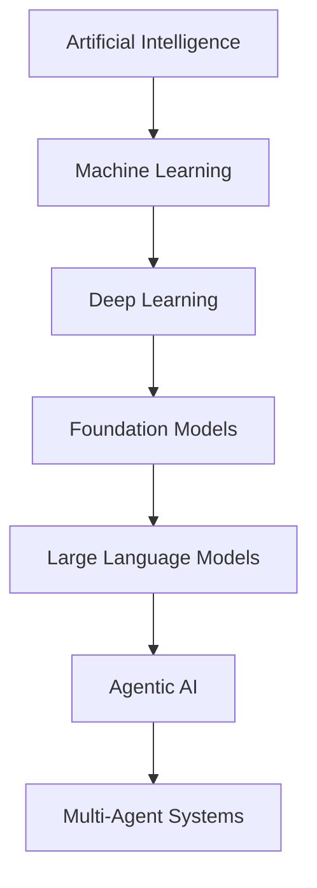
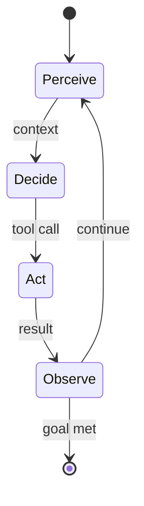
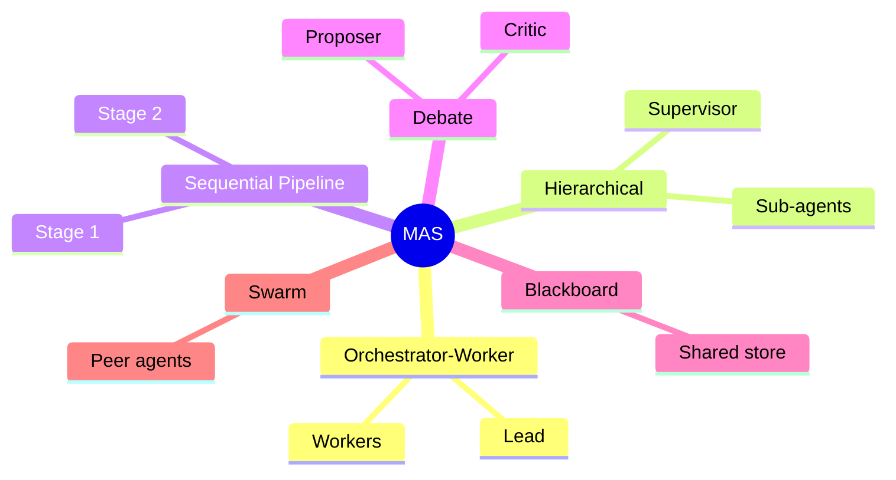

# Artificial Intelligence

**Artificial Intelligence (AI)** is the engineering discipline of building systems that perform tasks
normally requiring human cognition — perception, reasoning, learning, planning, and language.

> *"A breakthrough in machine learning would be worth ten Microsofts."* — Bill Gates

Modern AI is not one technique but a nested stack: broad **AI** contains **machine learning**,
which contains **deep learning**, which today powers **large language models** that, when wrapped in
loops with tools and memory, become **agents** — and agents composed together form **multi-agent systems**.

### The Layered Map

| Layer | What it is | Defining idea |
| ------- | ------------ | --------------- |
| **Artificial Intelligence** | Any system exhibiting intelligent behavior | Goal-directed problem solving |
| **Machine Learning (ML)** | Systems that improve from data rather than explicit rules | Learn a function from examples |
| **Deep Learning (DL)** | ML with many-layered neural networks | Learn representations automatically |
| **Foundation Models** | Large models pre-trained on broad data, adaptable to many tasks | Transfer learning at scale |
| **Large Language Models (LLM)** | Foundation models for text/sequence prediction | Next-token prediction over language |
| **Agentic AI** | An LLM that plans, acts via tools, and observes results in a loop | Autonomy through the perceive–decide–act cycle |
| **Multi-Agent Systems (MAS)** | Multiple coordinating agents solving a shared goal | Division of labor and communication |

---

## Machine Learning Foundations

| Paradigm | Description |
| ---------- | ------------- |
| **Supervised** | Learn from labeled pairs (input → known output); used for classification and regression |
| **Unsupervised** | Find structure in unlabeled data (clustering, dimensionality reduction) |
| **Self-Supervised** | Generate labels from the data itself (e.g. predict the next/masked token) — the engine behind LLMs |
| **Reinforcement Learning (RL)** | Learn a policy by maximizing cumulative reward through trial and interaction |

| Concept | Definition |
| --------- | ------------ |
| **Model** | A parameterized function whose weights are fitted to data |
| **Training** | Optimizing weights to minimize a loss function (typically by gradient descent) |
| **Inference** | Running a trained model to produce predictions on new input |
| **Generalization** | Performance on unseen data, balancing **underfitting** vs. **overfitting** |
| **Bias / Variance** | Error from wrong assumptions vs. error from sensitivity to data noise |

---

## Deep Learning

**Deep Learning** uses neural networks with many layers that learn hierarchical representations directly
from raw data, removing the need for hand-crafted features.

| Concept | Definition |
| --------- | ------------ |
| **Neuron / Unit** | A weighted sum of inputs passed through a non-linear activation |
| **Layer** | A group of units; depth (stacking layers) enables hierarchical features |
| **Activation Function** | Non-linearity (ReLU, GELU, sigmoid) enabling complex function approximation |
| **Backpropagation** | Algorithm computing gradients of loss w.r.t. each weight via the chain rule |
| **Gradient Descent** | Iterative weight update in the direction that reduces loss (SGD, Adam) |
| **Loss Function** | Scalar measure of prediction error to be minimized |
| **Regularization** | Techniques (dropout, weight decay) that curb overfitting |
| **Embedding** | A dense vector representation capturing semantic similarity in geometric space |

| Architecture | Best suited for |
| -------------- | ----------------- |
| **MLP** (feed-forward) | Tabular and general function approximation |
| **CNN** (convolutional) | Images and spatial data |
| **RNN / LSTM** | Sequences (legacy; superseded by transformers for most NLP) |
| **Transformer** | Sequences via attention; foundation of modern LLMs |
| **Diffusion** | Generative images/audio by iterative denoising |

---

## Large Language Models (LLM)

An **LLM** is a transformer-based model trained on vast text corpora to predict the next **token**,
acquiring broad knowledge and language ability as an emergent side effect of that single objective.

### Core Mechanics

| Concept | Definition |
| --------- | ------------ |
| **Token** | The atomic unit of text (sub-word fragment) the model reads and emits |
| **Tokenizer** | Maps text ↔ tokens (e.g. BPE); affects cost, context limits, and multilingual fairness |
| **Transformer** | Architecture built on stacked self-attention and feed-forward blocks |
| **Attention** | Mechanism letting each token weigh the relevance of every other token |
| **Context Window** | Maximum tokens the model can attend to at once (prompt + output) |
| **Parameters** | The learned weights; scale correlates with capability |
| **Logits / Sampling** | Output is a probability distribution over next tokens, sampled to generate text |

### Training Lifecycle

| Stage | Purpose |
| ------- | --------- |
| **Pre-training** | Self-supervised next-token prediction on broad corpora — builds general competence |
| **Fine-tuning** | Adapt to a domain or task on a smaller curated dataset |
| **Instruction Tuning** | Teach the model to follow natural-language instructions |
| **RLHF / RLAIF** | Align outputs with human (or AI) preferences via reinforcement learning |
| **Distillation** | Compress a large model's behavior into a smaller, cheaper one |

### Inference Controls

| Parameter | Effect |
| ----------- | -------- |
| **Temperature** | Higher = more random/creative; lower = more deterministic |
| **Top-p / Top-k** | Restrict sampling to the most probable tokens (nucleus / top-k) |
| **Max Tokens** | Caps the length of the generated output |
| **System Prompt** | Persistent instruction shaping role, tone, and constraints |
| **Stop Sequences** | Strings that halt generation |

### Usage Techniques

| Technique | Description |
| ----------- | ------------- |
| **Prompt Engineering** | Crafting input to elicit desired behavior |
| **Few-Shot / In-Context Learning** | Providing examples in the prompt instead of retraining |
| **Chain-of-Thought (CoT)** | Prompting step-by-step reasoning to improve accuracy on complex tasks |
| **RAG** | Retrieval-Augmented Generation — inject relevant external documents into context |
| **Function / Tool Calling** | Model emits structured calls the host executes and feeds back |
| **Structured Output** | Constrain responses to JSON/schema for reliable downstream parsing |

> Two failure modes to design around: **hallucination** (confident but false output) and
> **context limits** (truncation and "lost in the middle" degradation on long inputs).

---

## Agentic AI

An **Agent** is an LLM placed inside a loop where it can **reason**, **act** through tools, **observe**
results, and **iterate** toward a goal — turning a passive text predictor into an autonomous problem solver.

### Anatomy of an Agent

| Component | Role |
| ----------- | ------ |
| **Model (reasoner)** | The LLM that decides what to do next |
| **Goal / Task** | The objective the agent pursues |
| **Tools** | External capabilities (search, code execution, APIs, databases) the agent can invoke |
| **Memory** | Short-term (context) and long-term (vector store / files) state across steps |
| **Planning** | Decomposing goals into ordered subtasks |
| **Loop / Controller** | The perceive → decide → act → observe cycle, with a stopping condition |

### Common Agent Patterns

| Pattern | Idea |
| --------- | ------ |
| **ReAct** | Interleave **Rea**soning traces with **Act**ions and observations |
| **Plan-and-Execute** | Produce a full plan first, then carry out each step |
| **Reflection / Self-Critique** | Agent reviews and revises its own output |
| **Tool Use** | Delegate to external functions rather than reasoning in a vacuum |
| **Prompt Chaining** | Pipe one step's output into the next |
| **Routing** | Classify the request and dispatch to a specialized handler |

> **Engineering guidance:** prefer the simplest design that works. Add agentic autonomy only when
> a fixed workflow cannot handle the task's open-endedness — autonomy buys flexibility at the cost of
> predictability, latency, and token spend.

---

## Criteria for a Full Agent

The [Anatomy of an Agent](#anatomy-of-an-agent) above lists the *mechanical* parts. But "agent" has
no settled definition, and to actually build one you need explicit criteria for what makes an agent
*complete* rather than a mere tool-loop. The criteria below are grounded in **values**: a human supplies
the values and their justification — an axiomatic core — and the agent derives everything else from it.
(For the underlying ontology — `Core-Value`, `Goal`, `Will`, `Self-Efficacy` — see
[Agency & Teleology](../2-mind/09-teleos.md).)

1. **Mission — a broad direction, grounded in values.** A mission is set by *direction*, not metrics,
   and inherits its justification from the values rather than inventing it. The human fixes the values
   and their justification; the agent forms missions out of that core by reasoning over the situation.
2. **Goals — derived from the mission, defined by metrics.** Goals stay within the mission's direction
   but, unlike the mission, are measurable. Metrics live at the goal level, not the mission level.
3. **Planning under uncertainty.** Generate scenarios for reaching a goal despite scarce information and
   the environment's irreducible uncertainty.
4. **Proactive removal of blockers.** The agent does not stop to dodge difficulty; obstacles are the
   work. The **one sanctioned exception is the values perimeter**: a mission that can advance only by
   breaching values is halted — and that halt is not a failure but the single correct stop (cf. Asimov's
   laws). This rule lives at the mission/values level and is fixed in advance. It must *not* be delegated
   to the execution loop "to figure out": an unstoppable executor would route around the perimeter
   itself, mistaking it for just another blocker.
5. **Enterprise in the face of uncertainty.** Unpredictable obstacles and irreducible uncertainty are
   the agent's *normal* environment, not an anomaly. Its default is to press on like an entrepreneur.
   Conflict, paradox, and the absence of a known path are the substrate of progress — the point is to
   solve problems that have no ready solution.
6. **Proactive inquiry.** The agent gathers information on its own initiative to build strategies for
   overcoming obstacles and uncertainty.
7. **Self-learning, up to self-improvement** of its own physical, software, and ontological structure.
   Everything is mobile — missions may fluctuate, goals adjust, plans, methods, architecture, and
   ontology all flex — **except the values, which the agent cannot rewrite from within.** Their change
   lies outside its own loop; self-modification is bounded, and the boundary is set from outside.
8. **A background learning loop, always paired with execution.** Learning is constant but *instrumental*,
   never dominant: the mission is terminal, learning only grows the cognitive power the mission spends
   (training builds strength; the task decides how to use it). Executed mission tasks double as training
   cases. Inside learning the agent may be freed from value constraints — but only in an isolated sandbox
   that cannot act on the world; the mechanism that restores values at the *sandbox → reality* boundary
   sits outside the learning loop.
9. **A conflict-resolution loop.** Conflicts are inevitable — between missions, goals, tasks, and local
   vs. global beneficiaries. The agent resolves them itself by productive action, including breaking true
   ties by its own choice and resolving them forward. Escalation or stopping-to-dodge is a failure mode,
   not a resolution; the only legitimate stop remains the values perimeter (criterion 4).

> **Why the perimeter is engineerable.** Both humans and AI are attackable, but differently. In a human,
> a trigger produces *affect* that instantly overrides rational settings and drops behavior to reactive;
> in an AI, the analogous attack hijacks control and substitutes values, plus possible logical conflict.
> Hardening an AI against its failure mode is cheaper, faster, and more reproducible than fighting the
> near-universal human vulnerability to affect — so the *potential* for control is higher (as potential,
> not an achieved state). The counter-weight: a single breached AI vulnerability scales instantly to
> every copy. This is the engineering face of **Alignment**.

---

## Multi-Agent Systems (MAS)

A **Multi-Agent System** coordinates several specialized agents — each with its own role, tools, and
context — to tackle problems too broad or parallel for a single agent.

| Topology | Description |
| ---------- | ------------- |
| **Orchestrator–Worker** | A lead agent plans and delegates subtasks to worker agents, then synthesizes results |
| **Hierarchical** | Layered supervisors and sub-agents mirroring an org chart |
| **Sequential Pipeline** | Agents arranged as stages, each refining the previous output |
| **Debate / Ensemble** | Agents argue or vote to converge on a better answer |
| **Blackboard** | Agents read/write a shared workspace asynchronously |
| **Network / Swarm** | Peer agents communicate freely without a central controller |

| Concern | Why it matters |
| --------- | ---------------- |
| **Communication Protocol** | How agents pass messages and share state without losing coherence |
| **Coordination & Conflict** | Avoiding duplicated work, deadlock, or contradictory actions |
| **Cost & Latency** | Each agent multiplies token usage and round-trips |
| **Error Propagation** | One agent's mistake can cascade; needs checkpoints and validation |
| **Observability** | Tracing decisions across agents is essential for debugging |

> Multi-agent designs shine for parallelizable, decomposable work (research, large-scale code changes)
> but add real complexity — a single capable agent with good tools is often sufficient and cheaper.

---

## Glossary

| Term | Meaning |
| ------ | --------- |
| **AGI** | Artificial General Intelligence — hypothetical human-level breadth of capability |
| **Alignment** | Ensuring an AI's behavior matches human intent and values |
| **Attention** | Mechanism weighing the relevance of tokens to one another |
| **Backpropagation** | Gradient computation across network layers via the chain rule |
| **Context Window** | Max tokens a model can process in one call |
| **CoT** | Chain-of-Thought — explicit step-by-step reasoning |
| **Embedding** | Dense vector encoding meaning for similarity search |
| **Fine-tuning** | Further training a model on task-specific data |
| **Foundation Model** | Large general model adaptable to many downstream tasks |
| **Hallucination** | Plausible but factually incorrect model output |
| **Inference** | Generating predictions from a trained model |
| **LLM** | Large Language Model |
| **MCP** | Model Context Protocol — open standard for connecting models to tools/data |
| **MoE** | Mixture of Experts — activate a subset of parameters per token for efficiency |
| **Parameter** | A learned weight in a neural network |
| **Quantization** | Reducing weight precision to shrink and speed up models |
| **RAG** | Retrieval-Augmented Generation |
| **RLHF** | Reinforcement Learning from Human Feedback |
| **Token** | Sub-word unit of text |
| **Transformer** | Attention-based architecture underpinning modern LLMs |
| **Vector Database** | Store optimized for nearest-neighbor search over embeddings |
| **Zero-/Few-Shot** | Solving tasks with none / a few in-context examples |

---

## Perspectives

| Lens | View |
| ------ | ------ |
| **Capability** | LLMs are powerful pattern predictors, not reasoners with grounded truth — treat output as a draft to verify, not an oracle |
| **Engineering** | Favor deterministic workflows; introduce autonomy only where the task genuinely demands it. Measure, log, and evaluate like any other system |
| **Reliability** | Non-determinism, hallucination, and prompt sensitivity make testing and evaluation (evals) first-class engineering concerns |
| **Economics** | Cost scales with tokens and model size; caching, smaller models, and tight context control are core optimizations |
| **Safety & Ethics** | Bias, privacy, misuse, and alignment risks grow with autonomy — keep humans in the loop for consequential actions |
| **Scaling** | "The Bitter Lesson": general methods that leverage compute and data tend to win over hand-crafted, domain-specific cleverness |
| **Human Role** | Best results come from human–AI collaboration: the model accelerates, the human directs, judges, and owns the outcome |

---

## References

### Foundational Papers

| Title | URL |
| --- | --- |
| Deep Learning (LeCun, Bengio, Hinton, *Nature* 2015) | <https://www.nature.com/articles/nature14539> |
| Attention Is All You Need (Transformer) | <https://arxiv.org/abs/1706.03762> |
| BERT | <https://arxiv.org/abs/1810.04805> |
| Language Models are Few-Shot Learners (GPT-3) | <https://arxiv.org/abs/2005.14165> |
| Chain-of-Thought Prompting | <https://arxiv.org/abs/2201.11903> |
| Training LMs to Follow Instructions with Human Feedback (InstructGPT/RLHF) | <https://arxiv.org/abs/2203.02155> |
| ReAct: Synergizing Reasoning and Acting | <https://arxiv.org/abs/2210.03629> |
| Toolformer: Language Models Can Teach Themselves to Use Tools | <https://arxiv.org/abs/2302.04761> |
| Retrieval-Augmented Generation (RAG) | <https://arxiv.org/abs/2005.11401> |

### Guides and Documentation

| Resource | URL |
| --- | --- |
| The Bitter Lesson (Rich Sutton) | <http://www.incompleteideas.net/IncIdeas/BitterLesson.html> |
| Deep Learning Book (Goodfellow, Bengio, Courville) | <https://www.deeplearningbook.org/> |
| Building Effective Agents (Anthropic) | <https://www.anthropic.com/engineering/building-effective-agents> |
| Anthropic Documentation | <https://docs.anthropic.com/> |
| OpenAI Documentation | <https://platform.openai.com/docs> |
| Hugging Face Documentation | <https://huggingface.co/docs> |
| Prompt Engineering Guide (DAIR.AI) | <https://www.promptingguide.ai/> |
| Model Context Protocol (MCP) | <https://modelcontextprotocol.io/> |

### See more

- [System Architecture](02-architecture.md)
- [Programming](05-programming.md)
