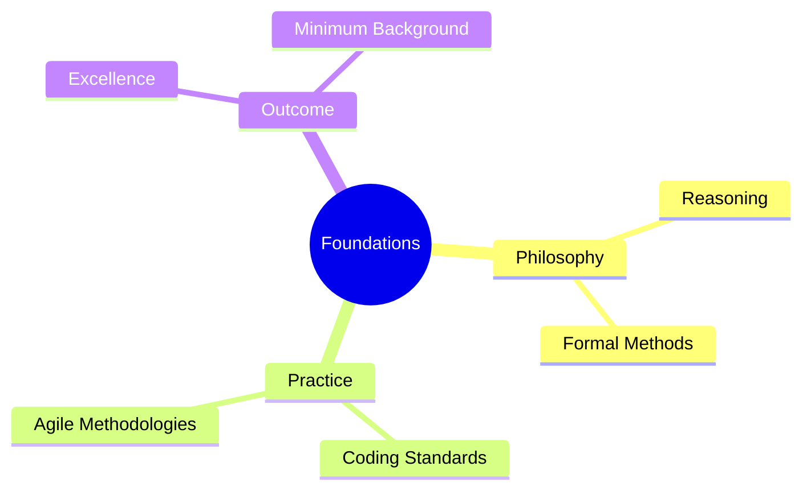
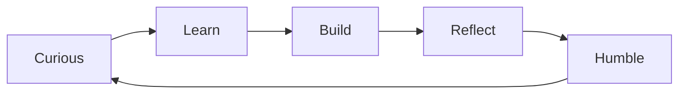

# Introduction to Modern Software Engineering

A Comprehensive Guide for the Practicing Engineer

This book is designed to be accessible yet comprehensive,
ensuring that every engineer has a solid foundation to grow with excellence in their daily work.

From philosophical reasoning and formal methods to practical coding standards and agile methodologies,
these concepts have covered the essential foundations every modern software engineer should understand
and form the minimum satisfactory background for excellence in software engineering.

The journey of learning never ends. Stay curious, stay humble, and keep building.

