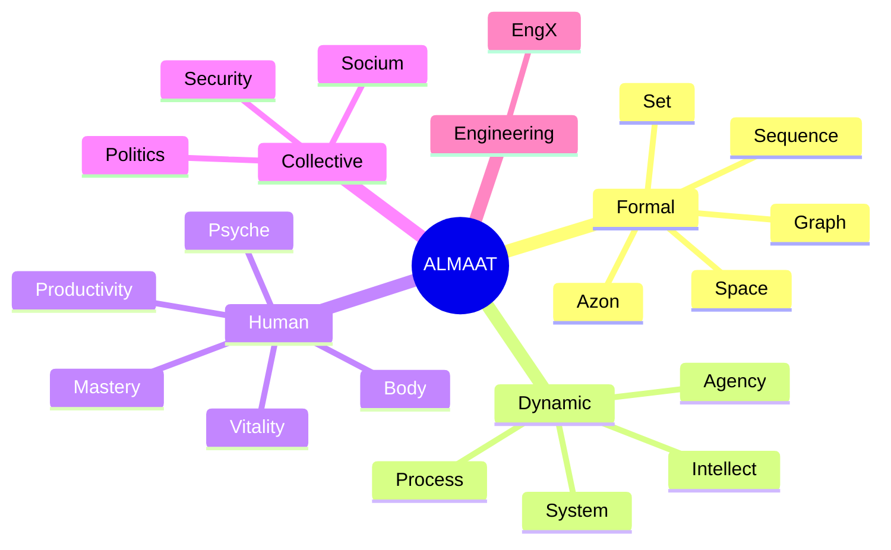

# Welcome to ALMAAT

ALMAAT is a general-purpose universal cognitive framework.

It builds a layered ontology from a single irreducible primitive (the `Azon`) through increasingly rich structures: `Set`, `Graph`, `Language`, `Sequence`, `Space`, dynamic `System`, `Mind`, `Agent`, and `Growth`.

