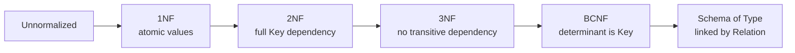

# Correspondence to Data Normalization

The primitives above align with the classical relational normal forms. `Schema` is the database schema; an `Type` is a normalized table; a `Presentation` is a row; a `Relation` carries foreign-key links.

---

**`1NF`** := Atomic values; no repeating groups.

*NOTE*: `Point := [v₁, ..., vₙ]` with `vᵢ ∈ COD(pᵢ)` — each coordinate is a single element of its Attribute's `Codomain`, atomic by construction.

---

**`2NF`** := 1NF and every non-key attribute depends on the whole `Key`.

*NOTE*: An `Type` whose non-`Key` Attributes are functions of the full `Key` only; partial dependencies force decomposition into separate `Type` linked by `Relation`.

---

**`3NF`** := 2NF and no transitive dependency between non-key attributes.

*NOTE*: Non-`Key` Attributes depend on the `Key` directly, not via another non-`Key` Attribute; transitive chains are factored into their own `Type`.

---

**`BCNF`** := Every functional determinant is a `Key`.

*NOTE*: For every functional dependency `X → Y` within an `Type`, `X` is a `Key` (injective Attribute or Attribute composite).

A fully normalized `Schema` is therefore a `Structure` of `Type` in BCNF, with every inter-table link expressed as a `Relation` over `Key` Attributes and every `Tuple` denoting one inter-entity connection.

